# NIRMAYA System Architecture & Data Flow Specification

**Project:** NIRMAYA (Networked Interoperable Records Medical Assets & Your Archives)  
**Specification Release:** 1.0 (HL7 FHIR R4 & Simulated ABDM M1/M2/M3)  
**Academic Target:** Final Year Major Project in Health Informatics

[](https://gitdiagram.com/suryanshswarn09/nirmaya?utm_source=readme&utm_medium=badge)

---

## 1. Architectural Philosophy & Overview

NIRMAYA is engineered as a **Unified Health Interoperability Network**. Unlike traditional siloed healthcare applications that isolate patient data within proprietary schema boundaries, NIRMAYA structures all medical records, encounter notes, and diagnostic observations around international healthcare standards: **HL7 FHIR Release 4** and India's **Ayushman Bharat Digital Mission (ABDM)**.

### End-to-End System Architecture & Component Flow

```mermaid
%% Generated by https://gitdiagram.com/suryanshswarn09/nirmaya
flowchart TD

subgraph group_experience["Web experience"]
  node_web["Role portals"]
  node_auth_ui["Sign-in and registration<br/>[page.tsx]"]
  node_api_client["API client<br/>[api.ts]"]
end

subgraph group_api["API and access"]
  node_auth["Authentication endpoints<br/>[auth.py]"]
  node_access["Token and role access<br/>[dependencies.py]"]
  node_router["API routing<br/>[router.py]"]
  node_app["FastAPI application<br/>[main.py]"]
end

subgraph group_clinical["Clinical workflows"]
  node_patient["Patient vault<br/>[patients.py]"]
  node_doctors["Doctor discovery<br/>[doctors.py]"]
  node_appointments["Appointment booking<br/>[appointments.py]"]
  node_slots["Slot generation and holds<br/>[slot_engine.py]"]
  node_conditions["Clinical conditions<br/>[conditions.py]"]
  node_observations["Vitals and observations<br/>[observations.py]"]
  node_notes["SOAP notes<br/>[soap_notes.py]"]
  node_diagnostics["Lab orders and reports<br/>[diagnostics.py]"]
  node_services["Domain services"]
end

subgraph group_interop["Interoperability"]
  node_fhir["FHIR schemas and transforms<br/>[transformers.py]"]
  node_abdm["ABDM exchange"]
end

subgraph group_persistence["Persistence"]
  node_models["Clinical data models"]
  node_database[("Relational database<br/>[session.py]")]
  node_supabase[("Supabase auth and storage")]
end

node_users(("Patients, doctors, labs"))

node_users -->|"use portals"| node_web
node_web -->|"sign in"| node_auth_ui
node_auth_ui -.->|"submit credentials"| node_api_client
node_api_client -.->|"call API"| node_app
node_app -->|"mount routes"| node_router
node_router -->|"route auth"| node_auth
node_router -->|"route patients"| node_patient
node_router -->|"route doctors"| node_doctors
node_router -->|"route appointments"| node_appointments
node_router -->|"route conditions"| node_conditions
node_router -->|"route observations"| node_observations
node_router -->|"route notes"| node_notes
node_router -->|"route diagnostics"| node_diagnostics
node_auth -->|"use identity checks"| node_access
node_users -->|"authenticate"| node_auth
node_doctors -->|"generate availability"| node_slots
node_appointments -->|"use domain services"| node_services
node_appointments -->|"hold slots"| node_slots
node_conditions -->|"use condition service"| node_services
node_diagnostics -->|"use diagnostic service"| node_services
node_conditions -->|"FHIR exchange"| node_fhir
node_diagnostics -->|"FHIR exchange"| node_fhir
node_models -->|"transform records"| node_fhir
node_services -.->|"operate on entities"| node_models
node_slots -->|"read and write slots"| node_database
node_services -.->|"persist records"| node_database
node_models -->|"map entities"| node_database
node_fhir -.->|"standards exchange"| node_abdm
node_app -.->|"integrate auth and storage"| node_supabase

click node_web "https://github.com/suryanshswarn09/nirmaya/tree/main/frontend/src/app"
click node_auth_ui "https://github.com/suryanshswarn09/nirmaya/blob/main/frontend/src/app/login/page.tsx"
click node_api_client "https://github.com/suryanshswarn09/nirmaya/blob/main/frontend/src/lib/api.ts"
click node_auth "https://github.com/suryanshswarn09/nirmaya/blob/main/backend/app/api/v1/endpoints/auth.py"
click node_access "https://github.com/suryanshswarn09/nirmaya/blob/main/backend/app/core/dependencies.py"
click node_router "https://github.com/suryanshswarn09/nirmaya/blob/main/backend/app/api/v1/router.py"
click node_app "https://github.com/suryanshswarn09/nirmaya/blob/main/backend/app/main.py"
click node_patient "https://github.com/suryanshswarn09/nirmaya/blob/main/backend/app/api/v1/endpoints/patients.py"
click node_doctors "https://github.com/suryanshswarn09/nirmaya/blob/main/backend/app/api/v1/endpoints/doctors.py"
click node_appointments "https://github.com/suryanshswarn09/nirmaya/blob/main/backend/app/api/v1/endpoints/appointments.py"
click node_slots "https://github.com/suryanshswarn09/nirmaya/blob/main/backend/app/services/slot_engine.py"
click node_conditions "https://github.com/suryanshswarn09/nirmaya/blob/main/backend/app/api/v1/endpoints/conditions.py"
click node_observations "https://github.com/suryanshswarn09/nirmaya/blob/main/backend/app/api/v1/endpoints/observations.py"
click node_notes "https://github.com/suryanshswarn09/nirmaya/blob/main/backend/app/api/v1/endpoints/soap_notes.py"
click node_diagnostics "https://github.com/suryanshswarn09/nirmaya/blob/main/backend/app/api/v1/endpoints/diagnostics.py"
click node_fhir "https://github.com/suryanshswarn09/nirmaya/blob/main/backend/app/fhir/transformers.py"
click node_abdm "https://github.com/suryanshswarn09/nirmaya/tree/main/backend/app/abdm"
click node_services "https://github.com/suryanshswarn09/nirmaya/tree/main/backend/app/services"
click node_models "https://github.com/suryanshswarn09/nirmaya/tree/main/backend/app/models"
click node_database "https://github.com/suryanshswarn09/nirmaya/blob/main/backend/app/db/session.py"

classDef toneNeutral fill:#f8fafc,stroke:#334155,stroke-width:1.5px,color:#0f172a
classDef toneBlue fill:#dbeafe,stroke:#2563eb,stroke-width:1.5px,color:#172554
classDef toneAmber fill:#fef3c7,stroke:#d97706,stroke-width:1.5px,color:#78350f
classDef toneMint fill:#dcfce7,stroke:#16a34a,stroke-width:1.5px,color:#14532d
classDef toneRose fill:#ffe4e6,stroke:#e11d48,stroke-width:1.5px,color:#881337
classDef toneIndigo fill:#e0e7ff,stroke:#4f46e5,stroke-width:1.5px,color:#312e81
classDef toneTeal fill:#ccfbf1,stroke:#0f766e,stroke-width:1.5px,color:#134e4a
class node_web,node_auth_ui,node_api_client toneBlue
class node_auth,node_access,node_router,node_app toneAmber
class node_patient,node_doctors,node_appointments,node_slots,node_conditions,node_observations,node_notes,node_diagnostics,node_services toneMint
class node_fhir,node_abdm toneRose
class node_models,node_database,node_supabase,node_users toneIndigo
```



### High-Level Topology Overview

```
                              +---------------------------------------+
                              |            NIRMAYA PLATFORM           |
                              +---------------------------------------+
                                                 |
             +-----------------------------------+-----------------------------------+
             |                                   |                                   |
             v                                   v                                   v
+-------------------------+         +-------------------------+         +-------------------------+
|   Patient Health Vault  |         |   Provider (Doctor) EMR |         | Diagnostic Lab Gateway  |
| (Appointments, Records, |         | (Encounter Notes, Rx,   |         | (Report Uploads,        |
|  ABHA ID, Timeline)     |         |  Clinical History)      |         |  Structured Parameters) |
+-------------------------+         +-------------------------+         +-------------------------+
             |                                   |                                   |
             +-----------------------------------+-----------------------------------+
                                                 |
                                          HTTPS / JSON API
                                                 |
                                                 v
                            +-----------------------------------------+
                            | Next.js 15 App Router + Tailwind CSS v4 |
                            | Framer Motion + TanStack Query          |
                            +-----------------------------------------+
                                                 |
                                          HTTPS / JSON API
                                                 |
                                                 v
                            +-----------------------------------------+
                            |     FastAPI (Python 3.11/3.12) Core     |
                            |  Pydantic v2 + SQLAlchemy 2.0 (ORM)     |
                            +-----------------------------------------+
                              /            |             \
                             /             |              \
                            v              v               v
            +-------------------+ +------------------+ +-----------------------+
            | PostgreSQL Engine | | Supabase Auth &  | | HL7 FHIR R4 & ABDM    |
            | (Relational DB &  | | Storage Buckets  | | Interoperability Hub  |
            |  Alembic Schema)  | | (PDF Reports)    | | (FHIR Bundles, ABHA)  |
            +-------------------+ +------------------+ +-----------------------+
```

---

## 2. The Three Network Stakeholders

### A. Patient Health Vault (Health Information Provider & Owner)
- Centralized, longitudinal health locker owned by the patient.
- Integrates simulated 14-digit ABHA ID (`XX-XXXX-XXXX-XXXX`) and memorable `<user>@abdm` handle.
- Granular consent manager allowing patients to grant or revoke time-bound access to specific doctors.
- Unified chronological medical timeline rendering prescriptions, lab results, and vitals.

### B. Provider (Doctor) EMR (Health Information User)
- Clinical consultation console providing verified historical timeline review upon patient consent.
- Vitals recording interface (BP, Pulse, SpO2, Temperature).
- Structured e-prescription builder with pharmaceutical ingredient autocompletion.
- Automatic transformation of consultation notes into FHIR `Encounter`, `Condition`, and `MedicationRequest`.

### C. Diagnostic (Lab) Gateway (Health Information Provider)
- Direct ingestion portal for accredited diagnostic centers and imaging clinics.
- Dual-channel report submission:
  1. Cryptographically stamped PDF report stored in private encrypted object storage.
  2. Structured quantitative `Observation` parameters (e.g. HbA1c in %, Fasting Glucose in mg/dL) stored in relational tables for longitudinal trend analysis.
- Automatic linkage to patient vault and instant notification dispatch.

---

## 3. Clinical Data Flows

### A. Consultation & Prescription Data Flow
```
1. Patient books appointment slot -> Atomic row-level lock in PostgreSQL
2. Doctor reviews historical timeline -> Verified via active Consent Token
3. Doctor documents encounter -> Saves Clinical Impression & Vitals
4. Doctor formulates e-Prescription -> Generates FHIR MedicationRequest
5. System renders signed PDF -> Digitally signed prescription archived in Patient Vault
```

### B. Diagnostic Upload & Ingestion Flow
```
1. Diagnostic Lab selects Patient by ABHA -> System verifies accredited lab role
2. Lab uploads binary report PDF -> Presigned URL generated, stored in private bucket
3. Lab inputs quantitative observations -> Formats into FHIR Observation resources
4. Atomic commit -> Updates patient longitudinal observations and notifies doctor
```

### C. Simulated ABDM Consent-Driven Exchange Flow
```
Doctor (HIU) -> Requests Access -> Consent Manager (CM) -> Pushes Prompt to Patient (HIP)
Patient Approves (Duration: 2 Hours, Scope: Prescriptions + Labs)
Consent Manager -> Issues Signed Consent Token -> Doctor decrypts and reviews FHIR Bundle
```

---

## 4. Security & Compliance Architecture

1. **Role-Based Access Control (RBAC):** Strict enforcement across 4 primary roles: `patient`, `doctor`, `lab`, `admin`.
2. **Audit Telemetry:** Every API transaction injects and logs an `X-Request-ID` UUID4 correlation identifier, recording client IP, endpoint, response status, and duration in `X-Process-Time`.
3. **Storage Security:** All clinical documents (PDFs, scans) reside in private Supabase Storage buckets accessible exclusively through short-lived presigned URLs.
4. **OWASP & Healthcare Headers:** Enforces `nosniff`, `DENY` clickjacking protection, modern content security policies, and parameterized query execution to prevent SQL injection.
