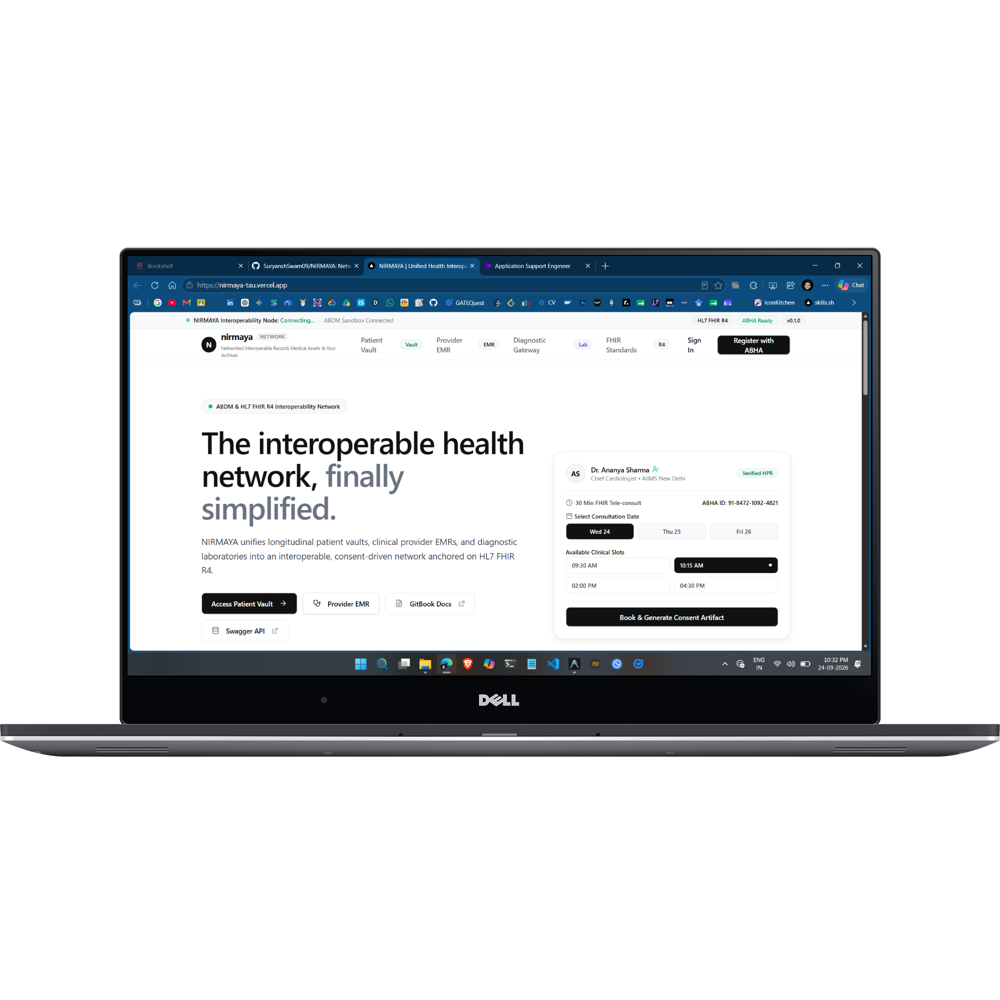

# NIRMAYA: Networked Interoperable Records Medical Assets & Your Archives

**A Unified Health Interoperability Network & Longitudinal Patient Vault**  
*Built on HL7 FHIR Release 4 and Simulated Ayushman Bharat Digital Mission (ABDM) Standards*

[Live Demo Portal](https://nirmaya-tau.vercel.app/) • [GitBook Documentation](https://suryanshs-projects.gitbook.io/nirmaya-docs) • [System Architecture](ARCHITECTURE.md) • [Changelog](CHANGELOG.md)

  

---

## The Vision at a Glance

Healthcare data worldwide—and particularly in expanding digital health ecosystems—suffers from severe fragmentation. When a patient visits multiple clinics, diagnostic labs, or hospital systems, their medical records are trapped in disparate database silos:

- Paper prescriptions get lost or degraded.
- Diagnostic lab results remain locked in unsearchable, unstructured PDF attachments.
- Doctors must treat patients with zero visibility into historical diagnoses, drug allergies, or concurrent medications.

**NIRMAYA** is engineered as a final-year major project to solve this exact dilemma. Rather than building a conventional, isolated CRUD web application, NIRMAYA implements an enterprise-grade interoperability network that treats medical data as structured, standardized, and patient-sovereign assets.

---

## Key Pillars of NIRMAYA

```mermaid
%% Generated by https://gitdiagram.com/suryanshswarn09/nirmaya
flowchart TD

subgraph group_experience["Web experience"]
  node_web["Role portals"]
  node_auth_ui["Sign-in and registration<br/>[page.tsx]"]
  node_api_client["API client<br/>[api.ts]"]
end

subgraph group_api["API and access"]
  node_auth["Authentication endpoints<br/>[auth.py]"]
  node_access["Token and role access<br/>[dependencies.py]"]
  node_router["API routing<br/>[router.py]"]
  node_app["FastAPI application<br/>[main.py]"]
end

subgraph group_clinical["Clinical workflows"]
  node_patient["Patient vault<br/>[patients.py]"]
  node_doctors["Doctor discovery<br/>[doctors.py]"]
  node_appointments["Appointment booking<br/>[appointments.py]"]
  node_slots["Slot generation and holds<br/>[slot_engine.py]"]
  node_conditions["Clinical conditions<br/>[conditions.py]"]
  node_observations["Vitals and observations<br/>[observations.py]"]
  node_notes["SOAP notes<br/>[soap_notes.py]"]
  node_diagnostics["Lab orders and reports<br/>[diagnostics.py]"]
  node_services["Domain services"]
end

subgraph group_interop["Interoperability"]
  node_fhir["FHIR schemas and transforms<br/>[transformers.py]"]
  node_abdm["ABDM exchange"]
end

subgraph group_persistence["Persistence"]
  node_models["Clinical data models"]
  node_database[("Relational database<br/>[session.py]")]
  node_supabase[("Supabase auth and storage")]
end

node_users(("Patients, doctors, labs"))

node_users -->|"use portals"| node_web
node_web -->|"sign in"| node_auth_ui
node_auth_ui -.->|"submit credentials"| node_api_client
node_api_client -.->|"call API"| node_app
node_app -->|"mount routes"| node_router
node_router -->|"route auth"| node_auth
node_router -->|"route patients"| node_patient
node_router -->|"route doctors"| node_doctors
node_router -->|"route appointments"| node_appointments
node_router -->|"route conditions"| node_conditions
node_router -->|"route observations"| node_observations
node_router -->|"route notes"| node_notes
node_router -->|"route diagnostics"| node_diagnostics
node_auth -->|"use identity checks"| node_access
node_users -->|"authenticate"| node_auth
node_doctors -->|"generate availability"| node_slots
node_appointments -->|"use domain services"| node_services
node_appointments -->|"hold slots"| node_slots
node_conditions -->|"use condition service"| node_services
node_diagnostics -->|"use diagnostic service"| node_services
node_conditions -->|"FHIR exchange"| node_fhir
node_diagnostics -->|"FHIR exchange"| node_fhir
node_models -->|"transform records"| node_fhir
node_services -.->|"operate on entities"| node_models
node_slots -->|"read and write slots"| node_database
node_services -.->|"persist records"| node_database
node_models -->|"map entities"| node_database
node_fhir -.->|"standards exchange"| node_abdm
node_app -.->|"integrate auth and storage"| node_supabase

click node_web "https://github.com/suryanshswarn09/nirmaya/tree/main/frontend/src/app"
click node_auth_ui "https://github.com/suryanshswarn09/nirmaya/blob/main/frontend/src/app/login/page.tsx"
click node_api_client "https://github.com/suryanshswarn09/nirmaya/blob/main/frontend/src/lib/api.ts"
click node_auth "https://github.com/suryanshswarn09/nirmaya/blob/main/backend/app/api/v1/endpoints/auth.py"
click node_access "https://github.com/suryanshswarn09/nirmaya/blob/main/backend/app/core/dependencies.py"
click node_router "https://github.com/suryanshswarn09/nirmaya/blob/main/backend/app/api/v1/router.py"
click node_app "https://github.com/suryanshswarn09/nirmaya/blob/main/backend/app/main.py"
click node_patient "https://github.com/suryanshswarn09/nirmaya/blob/main/backend/app/api/v1/endpoints/patients.py"
click node_doctors "https://github.com/suryanshswarn09/nirmaya/blob/main/backend/app/api/v1/endpoints/doctors.py"
click node_appointments "https://github.com/suryanshswarn09/nirmaya/blob/main/backend/app/api/v1/endpoints/appointments.py"
click node_slots "https://github.com/suryanshswarn09/nirmaya/blob/main/backend/app/services/slot_engine.py"
click node_conditions "https://github.com/suryanshswarn09/nirmaya/blob/main/backend/app/api/v1/endpoints/conditions.py"
click node_observations "https://github.com/suryanshswarn09/nirmaya/blob/main/backend/app/api/v1/endpoints/observations.py"
click node_notes "https://github.com/suryanshswarn09/nirmaya/blob/main/backend/app/api/v1/endpoints/soap_notes.py"
click node_diagnostics "https://github.com/suryanshswarn09/nirmaya/blob/main/backend/app/api/v1/endpoints/diagnostics.py"
click node_fhir "https://github.com/suryanshswarn09/nirmaya/blob/main/backend/app/fhir/transformers.py"
click node_abdm "https://github.com/suryanshswarn09/nirmaya/tree/main/backend/app/abdm"
click node_services "https://github.com/suryanshswarn09/nirmaya/tree/main/backend/app/services"
click node_models "https://github.com/suryanshswarn09/nirmaya/tree/main/backend/app/models"
click node_database "https://github.com/suryanshswarn09/nirmaya/blob/main/backend/app/db/session.py"

classDef toneNeutral fill:#f8fafc,stroke:#334155,stroke-width:1.5px,color:#0f172a
classDef toneBlue fill:#dbeafe,stroke:#2563eb,stroke-width:1.5px,color:#172554
classDef toneAmber fill:#fef3c7,stroke:#d97706,stroke-width:1.5px,color:#78350f
classDef toneMint fill:#dcfce7,stroke:#16a34a,stroke-width:1.5px,color:#14532d
classDef toneRose fill:#ffe4e6,stroke:#e11d48,stroke-width:1.5px,color:#881337
classDef toneIndigo fill:#e0e7ff,stroke:#4f46e5,stroke-width:1.5px,color:#312e81
classDef toneTeal fill:#ccfbf1,stroke:#0f766e,stroke-width:1.5px,color:#134e4a
class node_web,node_auth_ui,node_api_client toneBlue
class node_auth,node_access,node_router,node_app toneAmber
class node_patient,node_doctors,node_appointments,node_slots,node_conditions,node_observations,node_notes,node_diagnostics,node_services toneMint
class node_fhir,node_abdm toneRose
class node_models,node_database,node_supabase,node_users toneIndigo

```

1. **Patient Health Vault:** A self-sovereign locker where patients own their complete longitudinal medical history, control consent-based data sharing with doctors, and link their simulated 14-digit ABHA identity.
2. **Provider (Doctor) EMR:** An electronic medical record console enabling clinicians to review verified historical timelines, document clinical encounters, and issue structured e-prescriptions conforming to FHIR `MedicationRequest`.
3. **Diagnostic (Lab) Gateway:** A secured channel for accredited laboratories to upload both human-readable PDF reports and machine-readable FHIR `Observation` values directly into patient records.

---

## Documentation Structure

This GitBook documentation captures both the architectural blueprint and the live, daily development journal of NIRMAYA across a planned 4-month (16-week, 80-day) implementation timeline:

- **Part I: System Vision & Architecture:** The problem analysis, solution architecture, and technology selections.
- **Part II: Healthcare Standards:** In-depth mappings of HL7 FHIR R4 and simulated ABDM consent flows.
- **Part III: The 4-Month Development Journey:** Day-by-day micro-commit logs, architectural decisions, and technical milestones.
