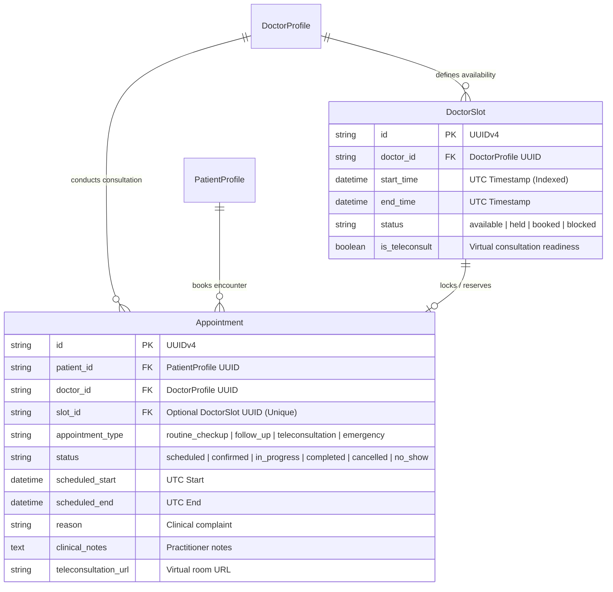

# Day 16: Appointment Scheduling Data Models & Slot Generation Engine

**Date:** September 28, 2026  
**Milestone:** 04-01 (Month 1, Week 4, Day 16)  
**Author:** Suryansh Swarn  
**Target Release:** `v0.1.0` (Scheduled for Day 20 close — **Strictly NO tag today**)

---

## 1. Overview & Objectives

With the foundation, relational schemas, Supabase authentication, RBAC authorization, and clinical portals completed in Weeks 1–3, Month 1 Week 4 advances into **Clinical Encounters & Appointment Orchestration**.

Day 16 delivers the relational data architecture, mathematical slot generation algorithm, and clinical booking API:
1. **Core Status Enums:** Aligned with HL7 FHIR R4 (`SlotStatus`, `AppointmentStatus`, `AppointmentType`).
2. **Relational Models & Migration:** `DoctorSlot` and `Appointment` models with foreign key cascades, unique constraints (`uq_doctor_slot_start`, `uq_appointment_slot_id`), and Alembic migration `0002_appointments_and_slots_schema`.
3. **Conflict-Free Slot Generation Engine:** Idempotent service subdividing clinical practice hours into discrete consultation windows, honoring lunch breaks, and skipping pre-existing intervals.
4. **Clinical Appointment Booking API:** Full lifecycle API supporting slot reservation, validation, status transitions (`scheduled` -> `in_progress` -> `completed` / `cancelled`), and automatic slot replenishment upon cancellation.
5. **Comprehensive Automated Verification:** 10 new integration tests bringing total test coverage to **125 passing tests (100% pass rate)**.

---

## 2. Relational Architecture & Entity Relationship



---

## 3. Mathematical Slot Generation Engine

The slot generation algorithm (`app/services/slot_engine.py`) guarantees idempotency and conflict prevention:
- **Practice Hours Window:** Iterates across target dates from `day_start` to `day_end` with step `slot_duration_minutes`.
- **Break Window Filtering:** Slots overlapping with `[break_start, break_end)` are excluded automatically.
- **Idempotency Check:** Queries existing slots in the date range, compares UTC timestamps, skips duplicates, and records `total_skipped_existing`.
- **Timezone Normalization:** Enforces UTC normalization across SQLite and PostgreSQL engines.

```python
# Sample slot generation payload
{
    "doctor_id": "doc-uuid-1234",
    "start_date": "2026-10-01",
    "end_date": "2026-10-05",
    "day_start_hour": 9,
    "day_start_minute": 0,
    "day_end_hour": 17,
    "day_end_minute": 0,
    "slot_duration_minutes": 30,
    "break_start_hour": 13,
    "break_end_hour": 14,
    "is_teleconsult": true
}
```

---

## 4. API Surface & Endpoints

| Method | Endpoint | Description | Auth Required |
|---|---|---|---|
| `GET` | `/api/v1/doctors/{doctor_id}/slots` | Query available or filtered slots for a doctor | Public / Authenticated |
| `POST` | `/api/v1/doctors/{doctor_id}/slots/generate` | Bulk generate conflict-free availability slots | Doctor Owner / Admin |
| `POST` | `/api/v1/appointments/` | Book clinical appointment reserving a slot | Patient / Admin |
| `GET` | `/api/v1/appointments/` | List appointments for authenticated user persona | Authenticated |
| `GET` | `/api/v1/appointments/{id}` | Retrieve appointment details | Participant / Admin |
| `PATCH` | `/api/v1/appointments/{id}/status` | Transition status (cancelling frees the slot) | Participant / Admin |

---

## 5. Automated Verification Results

- **Backend Pytest Suite:** **125 / 125 tests passing (100%)** in 27.41s.
  - 10 new tests in `backend/tests/test_appointments.py` validating slot counts, break exclusions, idempotency, availability queries, 409 double-booking conflicts, status progressions, and slot replenishment.
  - Migration upgrade and downgrade validated on `0002_appointments_and_slots_schema`.
- **Frontend Turbopack Build:** Clean compilation with **0 errors across all 11 static and edge routes** (`next build --turbopack`).
- **Tag Discipline:** Zero tags cut today (Monday of Week 4). The active release tag remains `v0.1.0-alpha.w3`. Next release tag `v0.1.0` scheduled for Day 20.
