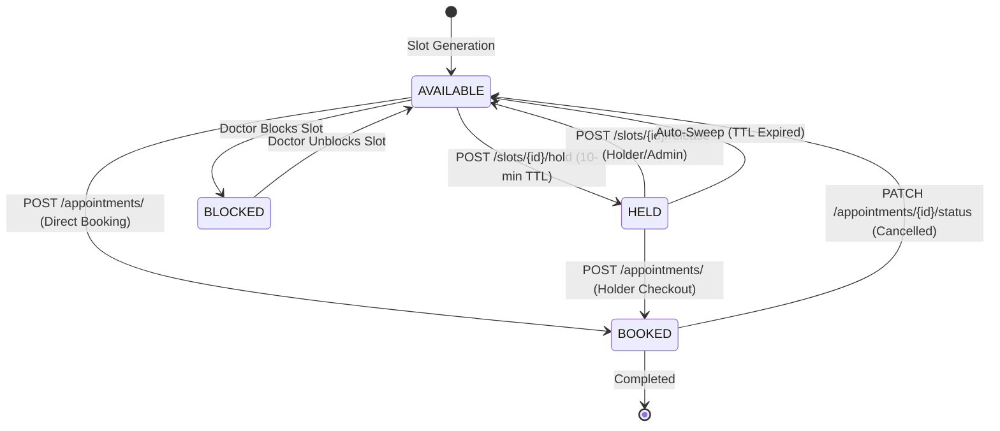

# Day 17: Slot Booking Concurrency, ACID Row-Level Locking & Held Slot Lifecycle

**Date:** September 29, 2026  
**Milestone:** 04-02 (Month 1, Week 4, Day 17)  
**Author:** Suryansh Swarn  
**Target Release:** `v0.1.0` (Scheduled for Day 20 close — **Strictly NO tag today**)

---

## 1. Overview & Objectives

In clinical encounter platforms, booking contention is one of the highest-risk failure domains: simultaneous checkout attempts by competing patients for the same consultation window can easily lead to duplicate appointments, orphaned reservations, or race condition crashes.

Day 17 implements an ACID-compliant, Cal.com-inspired concurrency architecture for NIRMAYA:
1. **Cal.com-Style Temporary Slot Holds:** 1–30 minute checkout reservation windows (default 10 minutes) preventing other patients from grabbing the slot during patient intake or payment checkout.
2. **ACID Row-Level Locking (`with_for_update`):** Enforces exclusive row locking on `DoctorSlot` during hold acquisition, hold release, and appointment booking to serialize concurrent transactions.
3. **Database-Level Integrity Backstops:** Wraps appointment insertion in `try ... except IntegrityError` to guarantee that even under extreme parallel contention across isolated connections, collisions on `appointment.slot_id` gracefully yield HTTP 409 Conflict rather than HTTP 500 crashes.
4. **Autonomous Expired Hold Auto-Sweep Engine:** Idempotent background sweep mechanism automatically releasing expired holds back to `AVAILABLE` status whenever availability queries or booking transactions are evaluated.
5. **Alembic Migration 0003:** Introduces `held_until` (indexed UTC timestamp) and `held_by_patient_id` (indexed foreign key with `SET NULL` on delete) using `batch_alter_table` for robust cross-dialect PostgreSQL and SQLite execution.
6. **High-Contention Concurrency Test Suite:** 9 rigorous unit, integration, and parallel stress tests (using `asyncio.gather` across 5 competing patient requests), bringing the platform test suite to **134 passing tests (100% pass rate)**.

---

## 2. Slot Lifecycle & State Machine



---

## 3. Relational Schema Evolution (Migration 0003)

Migration `0003_slot_concurrency_and_hold_fields` introduces hold tracking fields to `DoctorSlot` with cross-dialect Alembic batch operations:

```python
with op.batch_alter_table("doctor_slot") as batch_op:
    batch_op.add_column(
        sa.Column("held_until", sa.DateTime(timezone=True), nullable=True),
    )
    batch_op.add_column(
        sa.Column("held_by_patient_id", sa.String(length=36), nullable=True),
    )
    batch_op.create_index(
        batch_op.f("ix_doctor_slot_held_until"),
        ["held_until"],
        unique=False,
    )
    batch_op.create_index(
        batch_op.f("ix_doctor_slot_held_by_patient_id"),
        ["held_by_patient_id"],
        unique=False,
    )
    batch_op.create_foreign_key(
        "fk_doctor_slot_held_by_patient",
        "patient_profile",
        ["held_by_patient_id"],
        ["id"],
        ondelete="SET NULL",
    )
```

---

## 4. API Endpoints for Slot Hold & Release

| Method | Endpoint | Description | Auth Required |
|---|---|---|---|
| `POST` | `/api/v1/doctors/{doctor_id}/slots/{slot_id}/hold` | Reserve a slot for 1–30 min checkout window | Patient / Admin |
| `POST` | `/api/v1/doctors/{doctor_id}/slots/{slot_id}/release` | Manually release a held slot back to available | Holding Patient / Admin |
| `POST` | `/api/v1/appointments/` | Book slot (claims hold if reserved by caller, 409 if held by another) | Patient / Admin |
| `GET` | `/api/v1/doctors/{doctor_id}/slots` | Query slots (automatically sweeps expired holds before returning) | Public / Authenticated |

### Hold Response Sample
```json
{
  "success": true,
  "message": "Slot successfully reserved for 10 minutes",
  "data": {
    "slot_id": "72efb2c7-91c6-4507-829a-44ac001fe604",
    "doctor_id": "26e056d5-bf25-410a-8402-e4a900ba504f",
    "status": "held",
    "held_until": "2026-09-29T12:24:26.559801Z",
    "held_by_patient_id": "686523ba-744c-4bb7-925b-4f88eefcd269",
    "hold_duration_seconds": 600
  },
  "timestamp": "2026-09-29T12:14:26.567405Z"
}
```

---

## 5. Automated Verification Results

- **Backend Pytest Suite:** **134 / 134 tests passing (100% pass rate)** in 26.02s.
  - `test_slot_hold_success`: Verifies hold reservation and remaining seconds TTL calculation.
  - `test_slot_hold_conflict_when_already_held`: Verifies 409 `SLOT_HELD_BY_ANOTHER_PATIENT`.
  - `test_slot_release_by_holder`: Verifies holder can relinquish hold, restoring slot to available.
  - `test_slot_release_unauthorized`: Verifies 403 Forbidden when non-holder attempts release.
  - `test_convert_held_slot_to_confirmed_appointment`: Verifies holder converts hold to confirmed encounter.
  - `test_book_held_slot_by_other_patient_returns_409`: Verifies non-holder cannot book held slot.
  - `test_expired_hold_auto_sweep_on_query`: Verifies expired holds auto-sweep to available on query.
  - `test_expired_hold_claimed_by_new_booking`: Verifies new patient can book expired hold slot.
  - `test_parallel_booking_high_contention_race_condition`: Under simultaneous `asyncio.gather` contention by 5 competing patients, exactly 1 request succeeds (201 Created) and 4 receive 409 Conflict.
- **Alembic Migration Suite:** Upgrades and downgrades verified across revisions `0001`, `0002`, and `0003`.
- **Frontend Turbopack Build:** Clean compilation with **0 errors across all 11 routes** (`npm --prefix frontend run build`).
- **Pre-Flight System Diagnostics:** All 8 diagnostic checks passing (`python scripts/doctor.py`).
- **Tag Discipline:** Zero tags cut today (Tuesday of Week 4). The active release tag remains `v0.1.0-alpha.w3`. Next release tag `v0.1.0` scheduled for Day 20.
