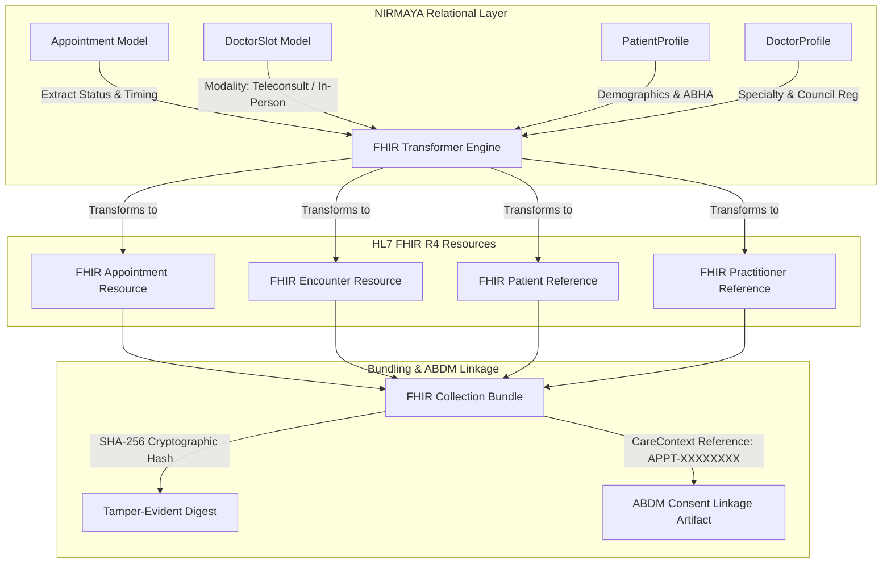

# Day 18: HL7 FHIR Encounter Transformers & ABDM Consent Linkage

**Date:** September 30, 2026  
**Milestone:** 04-03 (Month 1, Week 4, Day 18)  
**Author:** Suryansh Swarn  
**Target Release:** `v0.1.0` (Scheduled for Day 20 close — **Strictly NO tag today**)

---

## 1. Overview & Objectives

Healthcare interoperability requires that clinical encounters and scheduling models speak the lingua franca of global digital health: **HL7 FHIR Release 4 (R4)**, alongside compliance with India's **Ayushman Bharat Digital Mission (ABDM)** ecosystem.

Following Day 16 (appointment scheduling models and slot engine) and Day 17 (slot booking concurrency, ACID row locking, and 10-minute hold lifecycle), Day 18 establishes NIRMAYA's standards transformation and consent linkage layer:
1. **Pydantic v2 HL7 FHIR R4 Resource Schemas:** Implemented standard clinical data types (`FHIRIdentifier`, `FHIRCoding`, `FHIRCodeableConcept`, `FHIRReference`, `FHIRPeriod`, `FHIRParticipant`) and resources (`FHIRAppointment`, `FHIREncounter`, `FHIRBundle`).
2. **Clinical Status & Class Mapping Engine:** Established bijective mappings between NIRMAYA internal appointment states (`CONFIRMED`, `PENDING`, `CANCELLED`, `COMPLETED`, `NO_SHOW`) and HL7 FHIR codes (`booked`, `proposed`, `cancelled`, `fulfilled`, `noshow` for `Appointment`; `planned`, `finished`, `cancelled` for `Encounter`).
3. **Clinical Act Classification:** Distinguished between Ambulatory (`AMB` - `http://terminology.hl7.org/CodeSystem/v3-ActCode`) and Virtual / Teleconsultation (`VR`) encounters based on slot modality.
4. **Multi-Resource FHIR Collection Bundle:** Bundled `Appointment`, `Encounter`, `Patient`, and `Practitioner` resources into a single canonical FHIR collection bundle with unique `urn:uuid:` identifiers.
5. **ABDM CareContext Linkage & Cryptographic Integrity:** Derived canonical ABDM CareContext references (`APPT-XXXXXXXX`) and computed SHA-256 tamper-evident digital signatures over bundle artifacts.
6. **Clinical FHIR & ABDM API Endpoints:** Exposed standard endpoints under `/api/v1/appointments/{id}/` (`/fhir`, `/encounter`, `/fhir-bundle`, `/abdm/link-consent`) protected by strict RBAC authorization guards.
7. **Comprehensive Test Suite:** Developed 11 unit and integration tests, expanding the platform test suite to **145 passing tests (100% pass rate)**.

---

## 2. HL7 FHIR R4 Mapping Architecture



---

## 3. Status & Class Code System Mappings

### Appointment Status Mapping
| NIRMAYA Status | HL7 FHIR Appointment Status | Code System |
|---|---|---|
| `CONFIRMED` | `booked` | `http://hl7.org/fhir/appointmentstatus` |
| `PENDING` | `proposed` | `http://hl7.org/fhir/appointmentstatus` |
| `CANCELLED` | `cancelled` | `http://hl7.org/fhir/appointmentstatus` |
| `COMPLETED` | `fulfilled` | `http://hl7.org/fhir/appointmentstatus` |
| `NO_SHOW` | `noshow` | `http://hl7.org/fhir/appointmentstatus` |

### Encounter Status & Class Mapping
| Modality / Status | FHIR Encounter Status / Class | Code System / Coding |
|---|---|---|
| Status: `CONFIRMED` / `PENDING` | `planned` | `http://hl7.org/fhir/encounter-status` |
| Status: `COMPLETED` | `finished` | `http://hl7.org/fhir/encounter-status` |
| Status: `CANCELLED` / `NO_SHOW` | `cancelled` | `http://hl7.org/fhir/encounter-status` |
| Class: Teleconsultation (`is_teleconsult=True`) | `VR` (Virtual) | `http://terminology.hl7.org/CodeSystem/v3-ActCode` |
| Class: In-Person (`is_teleconsult=False`) | `AMB` (Ambulatory) | `http://terminology.hl7.org/CodeSystem/v3-ActCode` |

---

## 4. API Endpoints for FHIR & ABDM Integration

| Method | Endpoint | Description | Auth Required |
|---|---|---|---|
| `GET` | `/api/v1/appointments/{id}/fhir` | Export appointment as FHIR R4 `Appointment` resource | Patient / Doctor / Admin |
| `GET` | `/api/v1/appointments/{id}/encounter` | Export clinical encounter as FHIR R4 `Encounter` resource | Patient / Doctor / Admin |
| `GET` | `/api/v1/appointments/{id}/fhir-bundle` | Multi-resource FHIR R4 Collection `Bundle` (`Appointment`, `Encounter`, `Patient`, `Practitioner`) | Patient / Doctor / Admin |
| `POST` | `/api/v1/appointments/{id}/abdm/link-consent` | Link ABDM consent artifact with CareContext `APPT-XXXXXXXX` and SHA-256 signature | Patient / Doctor / Admin |

### Sample ABDM Consent Linkage Response
```json
{
  "success": true,
  "message": "Encounter linked to ABDM consent artifact successfully",
  "data": {
    "care_context_reference": "APPT-06EC8B98",
    "consent_id": "CONSENT-9941a8e1-d602-4fc4-b152-32a76fdf7c2e",
    "patient_reference": "Patient/686523ba-744c-4bb7-925b-4f88eefcd269",
    "doctor_reference": "Practitioner/26e056d5-bf25-410a-8402-e4a900ba504f",
    "status": "linked",
    "linked_at": "2026-09-30T10:45:00Z",
    "sha256_bundle_digest": "4f8a7e0b12c5890e...a9b31d87e0",
    "fhir_bundle": {
      "resourceType": "Bundle",
      "type": "collection",
      "total": 4,
      "entry": [...]
    }
  }
}
```

---

## 5. Security & RBAC Guards

Access to clinical FHIR resources and ABDM consent linkage is strictly gated:
- **Patient Access:** Patients may only inspect and link their own appointments (`current_user.id == appointment.patient.user_id`).
- **Doctor Access:** Doctors may only inspect and link encounters under their care (`current_user.id == appointment.doctor.user_id`).
- **Admin Access:** Platform administrators possess organizational audit rights.
- **Unauthorized Requests:** Any third party receives immediate `HTTP 403 Forbidden` (`INSUFFICIENT_PERMISSIONS`).

---

## 6. Automated Verification & Quality Metrics

1. **FHIR & ABDM Test Suite:**
   - 11 unit & integration tests in `backend/tests/test_fhir_encounter.py` passing 100% in 0.92s.
2. **Total Backend Pytest Suite:**
   - **145 / 145 tests passing (100%)** in 24.89s.
3. **Frontend Production Build:**
   - Next.js 15 Turbopack compiled **11 / 11 static and edge routes with 0 errors** in 42s.
4. **Pre-Flight Diagnostic Suite:**
   - `python scripts/doctor.py`: **8 / 8 checks passing**.
5. **Tag Discipline Honored:**
   - **Zero tags cut today.** Active release tag remains `v0.1.0-alpha.w3`. Milestone tag `v0.1.0` reserved for Day 20 close.
