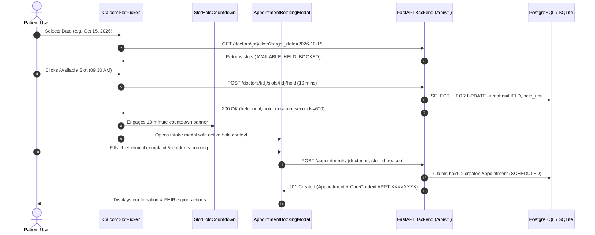

# Day 19: Cal.com Slot Picker UI Integration & Clinical Booking Flow

**Date:** October 1, 2026  
**Milestone:** 04-04 (Month 1, Week 4, Day 19)  
**Author:** Suryansh Swarn  
**Target Release:** `v0.1.0` (Scheduled for Day 20 close — **Strictly NO tag today**)

---

## 1. Overview & Objectives

While Days 16 through 18 built the backend foundation for clinical encounters (relational scheduling schemas, conflict-free slot subdivision, ACID row-level locking, 10-minute hold lifecycles, and HL7 FHIR R4 encounter transformers), **Day 19** translates these standards into an elegant, Cal.com-inspired user interface.

Healthcare scheduling is traditionally cumbersome and error-prone. NIRMAYA's Day 19 UI integration delivers a modern, frictionless booking experience adhering to the Cal.com Design System (`#ffffff` canvas, near-black `#111111` CTAs, soft 12px/16px radii, and real product UI chrome):
1. **Frontend API Client Expansion (`frontend/src/lib/api.ts`):** Complete TypeScript definitions and asynchronous methods for doctor slot queries, slot generation, 10-minute holds, manual hold releases, and clinical appointment bookings.
2. **Cal.com Interactive Slot Picker (`CalcomSlotPicker.tsx`):**
   - Dual-column layout: A monthly calendar matrix on the left, paired with available time slot buttons on the right.
   - Interactive month navigation with quick presets ("Today", "Tomorrow").
   - Real-time slot status styling (`AVAILABLE`, `HELD`, `BOOKED`, `BLOCKED`) with modality indicators (`AMB` Ambulatory Clinic vs `VR` Virtual Telehealth).
   - Automated temporary 10-minute hold acquisition upon slot selection to protect patients during intake.
3. **Cal.com Slot Hold Countdown Banner (`SlotHoldCountdown.tsx`):**
   - Reassuring timer displaying remaining reservation time (e.g. `09:48`) with urgency alerts (<2 minutes) and manual hold release capabilities.
4. **Clinical Appointment Booking Modal (`AppointmentBookingModal.tsx`):**
   - Clean, focused intake modal showing selected doctor, date/time, consultation fee, and active hold countdown.
   - Intake fields for chief complaint, clinical notes, appointment type, and ABHA ID.
   - Post-booking confirmation with ABDM CareContext badge (`APPT-XXXXXXXX`) and instant FHIR R4 Bundle export.
5. **Doctor Availability & Slot Generation Manager (`DoctorSlotManager.tsx`):**
   - Integrated into the `/doctor` provider portal.
   - Configurable practice hours (09:00 - 17:00), slot interval (15/30/45/60m), and lunch break exclusion (13:00 - 14:00).
   - One-click bulk conflict-free slot generation and live slot matrix inspection.
6. **Patient Vault & Provider EMR Experience Upgrades:**
   - Seamless integration in `frontend/src/app/patient/page.tsx` and `frontend/src/app/doctor/page.tsx` via `NavPillGroup`.
7. **End-to-End Automated Integration Test Suite (`test_calcom_booking_flow.py`):**
   - Expanded platform test suite to **146 passing tests (100% pass rate)**.

---

## 2. Interaction & Concurrency Architecture

---

## 3. Cal.com Design Tokens & Visual Hierarchy

| Element | Cal.com Token / Class | Style Specification |
|---|---|---|
| **Canvas** | `#ffffff` | Pure white background |
| **Primary CTAs** | `#111111` | Near-black background, white text, 8px radius, hover `#242424` |
| **Card Surfaces** | `#ffffff` / `#f8f9fa` | 12px / 16px radius (`rounded-xl` / `rounded-2xl`), 1px hairline border (`#e5e7eb`) |
| **Hold Active Badge** | `#ecfdf5` / `#10b981` | Emerald border, emerald text, live countdown timer |
| **Compromised / Expired** | `#fff7ed` / `#ea580c` | Warm amber warning with urgent alert state under 120 seconds |
| **Pill Switchers** | `NavPillGroup` | Signature Cal.com pill-radius container (`#f8f9fa`) with active white pill |

---

## 4. Key Components Delivered

- [api.ts](file:///e:/nirmaya-side/frontend/src/lib/api.ts): Complete typed client methods for doctor slots, holds, releases, slot generation, and clinical appointments.
- [SlotHoldCountdown.tsx](file:///e:/nirmaya-side/frontend/src/components/appointments/SlotHoldCountdown.tsx): Temporary reservation countdown with release handler.
- [CalcomSlotPicker.tsx](file:///e:/nirmaya-side/frontend/src/components/appointments/CalcomSlotPicker.tsx): Dual-column interactive calendar matrix and slot picker.
- [AppointmentBookingModal.tsx](file:///e:/nirmaya-side/frontend/src/components/appointments/AppointmentBookingModal.tsx): Intake modal with chief complaint validation and ABDM CareContext confirmation.
- [DoctorSlotManager.tsx](file:///e:/nirmaya-side/frontend/src/components/appointments/DoctorSlotManager.tsx): Practice schedule configuration, lunch break exclusion, and bulk conflict-free slot generation.
- [index.ts](file:///e:/nirmaya-side/frontend/src/components/appointments/index.ts): Standard module exports.
- [patient/page.tsx](file:///e:/nirmaya-side/frontend/src/app/patient/page.tsx): Upgraded patient vault with Cal.com booking tab and scheduled encounters list.
- [doctor/page.tsx](file:///e:/nirmaya-side/frontend/src/app/doctor/page.tsx): Upgraded doctor EMR with availability management tab.
- [test_calcom_booking_flow.py](file:///e:/nirmaya-side/backend/tests/test_calcom_booking_flow.py): End-to-end integration test validating the entire booking lifecycle.

---

## 5. Verification & Test Suite Metrics

1. **Frontend Production Compilation:**
   - `npm --prefix frontend run build`: **11 / 11 static and edge routes compiled with zero errors** in 42s.
2. **Backend Automated Pytest Suite:**
   - `pytest backend/tests -q`: **146 / 146 passed (100%)** in 31.07s.
3. **End-to-End Cal.com Journey Test:**
   - `pytest backend/tests/test_calcom_booking_flow.py -v`: **1 / 1 passed (100%)** in 1.12s.
4. **Pre-Flight System Diagnostics:**
   - `python scripts/doctor.py`: **8 / 8 checks passing**.
5. **Tag Discipline Honored:**
   - **Zero tags cut today.** Active release tag remains `v0.1.0-alpha.w3`. Milestone tag `v0.1.0` is reserved for Day 20 close.
