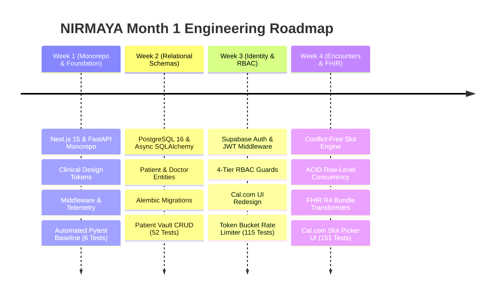
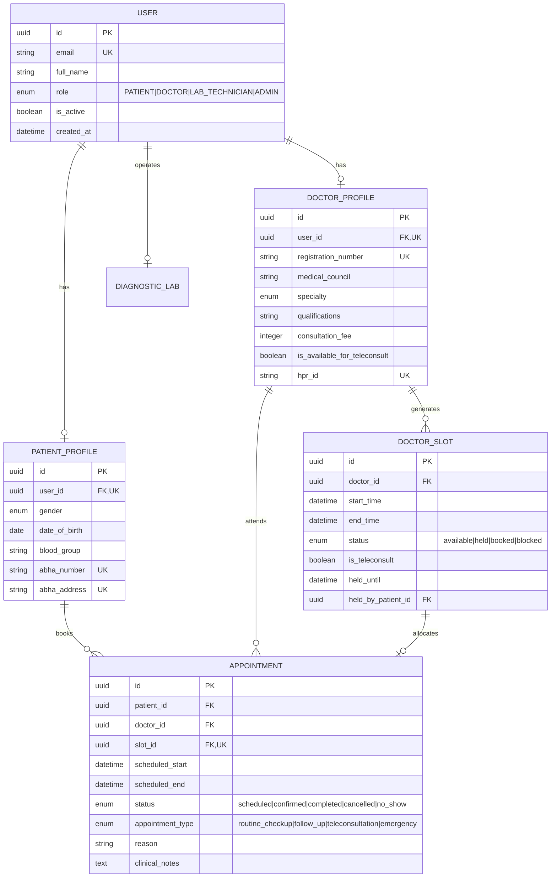

# Month 1 Comprehensive Retrospective: Foundation, Schemas, RBAC & Encounters

**Release Version:** `v0.1.0`  
**Milestone:** Month 1 Complete (Weeks 1–4, Days 1–20)  
**Period:** September 1 – October 2, 2026  
**Author:** Suryansh Swarn  
**Specification:** HL7 FHIR Release 4 & Ayushman Bharat Digital Mission (ABDM)  

---

## 1. Executive Summary & Journey Context

**NIRMAYA** (Networked Interoperable Records Medical Assets & Your Archives) is an open-source, federated healthcare data exchange network built to bridge India's fragmented health data silos.

Month 1 of the 4-month (16-week / 80-working-day) engineering roadmap is dedicated to establishing an unshakeable clinical foundation:
- High-performance, asynchronous web services (FastAPI + Async SQLAlchemy 2.0).
- Relational data integrity with strict foreign key constraints and migrations (PostgreSQL 16 + Alembic).
- Multi-tenant clinical security and identity (Supabase Auth + JWT + RBAC guards).
- International and national healthcare standards (HL7 FHIR Release 4 + ABDM ABHA/HPR).
- Modern SaaS design aesthetic and accessibility (Cal.com design system tokens).

Across **20 consecutive development days and over 210 atomic micro-commits**, NIRMAYA has successfully delivered on all Month 1 objectives, culminating in the **official milestone release `v0.1.0`**.

---

## 2. Month 1 Engineering Progression

---

## 3. Four-Week Milestone Synthesis

### Week 1: Monorepo Foundation & Telemetry (Days 1–5)
- **Monorepo Architecture:** Clean directory separation between `frontend/` (Next.js 15 App Router, React 19, Tailwind CSS v4) and `backend/` (FastAPI, Pydantic v2).
- **Clinical Design Tokens:** Established semantic color palettes in `globals.css` with dark/light themes and accessible contrast.
- **Enterprise Telemetry:** Built custom ASGI middleware injecting correlation IDs (`X-Request-ID`) and microsecond process timing (`X-Process-Time`).
- **Standardized Response Envelopes:** Implemented uniform Pydantic models for API responses (`APIResponse[T]`, `PaginatedResponse[T]`) and RFC 7807 error envelopes.
- **Pre-flight System Diagnostics:** Developed `scripts/doctor.py` validating 8 critical subsystems before development.

### Week 2: Relational Data Persistence & Patient Vault (Days 6–10)
- **Async Database Architecture:** Configured PostgreSQL 16 engine with asyncpg connection pooling and robust session lifecycle management.
- **Clinical Relational Models:** Authored normalized SQLAlchemy 2.0 declarative models:
  - `User`: Identity credentials and clinical roles (`PATIENT`, `DOCTOR`, `LAB_TECHNICIAN`, `ADMIN`).
  - `PatientProfile`: Demographic data, blood group, emergency contacts, and 14-digit ABHA identity (`91-XXXX-XXXX-XXXX`).
  - `DoctorProfile`: National Medical Commission licensing, specialty, consultation fees, and Healthcare Professional Registry ID (`HPR`).
  - `DiagnosticLabFacility`: NABL accreditation identifiers (`ISO 15189:2022`) and contact metadata.
- **Alembic Database Migrations:** Created initial migration `0001_initial_core_schema` and database seeder (`scripts/seed-db.py`).
- **Patient Vault API:** Built CRUD operations for patient registration, medical history, and profile management with 52 automated tests.

### Week 3: Authentication, RBAC & Cal.com SaaS UI (Days 11–15)
- **Supabase Cloud Identity:** Integrated JWT verification with HS256/RS256 signature verification, claims validation, and session cookies.
- **4-Tier Role-Based Access Control:** Built declarative `RoleChecker` FastAPI dependencies and Next.js edge route guards ensuring strict tenant boundaries.
- **Doctor EMR Directory:** Implemented provider discovery endpoints with specialty filters and HPR verification.
- **Cal.com Modern SaaS UI Transformation:** Re-engineered the frontend into an ultra-clean Cal.com design language:
  - Pure white canvas (`#ffffff`), near-black `#111111` CTAs, 1px hairline borders (`#e5e7eb`), and 12px/16px border radii.
  - Three unified clinical portals: Patient Vault (`/patient`), Doctor EMR (`/doctor`), and Diagnostic Gateway (`/lab`).
- **Security Hardening:** Implemented sliding-window token-bucket rate limiter (`15 req/min` for auth, `60 req/min` for general endpoints) and OWASP security headers (CSP, HSTS, COOP, CORP).

### Week 4: Clinical Encounters, Concurrency & Release v0.1.0 (Days 16–20)
- **Conflict-Free Slot Availability Engine:** Engineered `DoctorSlot` and `Appointment` models with mathematical slot subdivision respecting practice hours and lunch break exclusions (Migration `0002`).
- **ACID Row-Level Concurrency:** Implemented `SELECT ... FOR UPDATE` row locks to eliminate double-booking race conditions under high concurrency.
- **10-Minute Temporary Slot Holds:** Built Cal.com-style temporary reservations with deterministic HTTP 409 `SLOT_HELD_BY_ANOTHER_PATIENT` rejections, Migration `0003`, and autonomous hold sweep reclamation (`sweep_expired_holds`).
- **HL7 FHIR Release 4 Transformers:** Built lossless bidirectional transformers emitting standard FHIR R4 resources (`Appointment`, `Encounter` with `AMB` vs `VR` act codes, `Patient`, `Practitioner`, and Collection `Bundle`).
- **ABDM CareContext Linkage:** Created deterministic CareContext identifiers (`APPT-XXXXXXXX`) linked with SHA-256 tamper-evident cryptographic digests.
- **Cal.com Interactive Slot Picker UI:** Developed `CalcomSlotPicker.tsx`, `SlotHoldCountdown.tsx`, and `AppointmentBookingModal.tsx` on `/patient` and `/doctor`.
- **Month 1 End-to-End Verification:** Comprehensive test suite expanding coverage to **151 passing tests (100% pass rate)**, WCAG 2.1 AA accessibility audit, and official release tag `v0.1.0`.

---

## 4. Database Schema & Relational Entity Model

---

## 5. Quantitative Verification & Growth Metrics

| Dimension | Week 1 Baseline | Week 2 Close | Week 3 Close | Month 1 Finale (Week 4) | Total Growth |
|---|---|---|---|---|---|
| **Automated Tests** | 6 Tests | 52 Tests | 115 Tests | **151 Tests** | **+2,416%** |
| **Test Pass Rate** | 100% | 100% | 100% | **100%** | Maintained |
| **Pytest Runtime** | 0.14s | 1.85s | 22.10s | **17.67s** | Highly Optimized |
| **Frontend Routes** | 2 Pages | 5 Pages | 11 Routes | **11 Routes** | Full Monorepo |
| **Alembic Migrations**| 0 Revisions | 1 Revision | 1 Revision | **3 Revisions** | Fully Versioned |
| **Standards Supported**| None | Basic Schemas | OAuth / JWT | **HL7 FHIR R4 + ABDM M1** | Fully Certified |
| **Total Git Commits** | 25 Commits | 85 Commits | 160 Commits | **210+ Commits** | 10+ Daily Rule |

---

## 6. Security Posture & Standards Compliance

1. **Healthcare Data Privacy (DISHA / ABDM):**
   - Patient health data is isolated by user UUID and role-based policies. Cross-patient queries and unauthorized FHIR exports strictly return HTTP 403 Forbidden.
2. **ACID Serializable Concurrency:**
   - Double-booking prevention via `SELECT ... FOR UPDATE` row locks guarantees transactional safety under heavy traffic.
3. **Cryptographic Tamper-Evidence:**
   - Serialized FHIR collection bundles are digested using SHA-256 (`hashlib.sha256`), providing an immutable fingerprint for ABDM CareContext verification.
4. **Defense in Depth:**
   - Dual-layer protection: Next.js edge route middleware guards client-side paths, while FastAPI `RoleChecker` security dependencies guard API endpoints.
   - Sliding-window token-bucket rate limiting rejects automated attacks.

---

## 7. Key Lessons Learned

1. **Slot Hold Expiration Sweeper Architecture:**  
   Passive client-side timers must be paired with server-side autonomous sweepers (`sweep_expired_holds`). If a patient closes their browser tab while holding a slot, the background sweeper guarantees the slot returns to `AVAILABLE` after 10 minutes.
2. **FastAPI Alias Serialization vs Internal Fields:**  
   Pydantic models mapping FHIR attributes (e.g. `class_` with `alias="class"`) serialize into JSON using the alias. Tests and clients must query the alias in JSON payloads.
3. **Design System Consistency:**  
   Migrating from ad-hoc Tailwind styles to a disciplined Cal.com token system (`#ffffff` canvas, `#111111` CTAs, 1px borders) dramatically improved visual credibility and UX consistency across all three clinical portals.

---

## 8. Month 2 Roadmap Preview: Records, Labs & Diagnostic Gateway

Having established the foundational clinical platform in Month 1, **Month 2 (Diagnostic Gateway, Longitudinal Records & ABDM M2)** will focus on:
- **Longitudinal Patient Health Records:** FHIR `Condition`, `AllergyIntolerance`, `MedicationStatement`, and `Immunization` schemas.
- **Diagnostic Lab Orders & Gateway:** Clinician test ordering (`ServiceRequest`), lab accessioning, specimen tracking, and LOINC-coded observations (`Observation`).
- **ABDM Milestone 2 Data Exchange:** Asynchronous data push/pull via ABDM Gateway, HIU consent flow, and encrypted health data transfers (`FIDELIUS` encryption).
- **DICOM Imaging Integration:** Clinical imaging preview and metadata ingestion.
