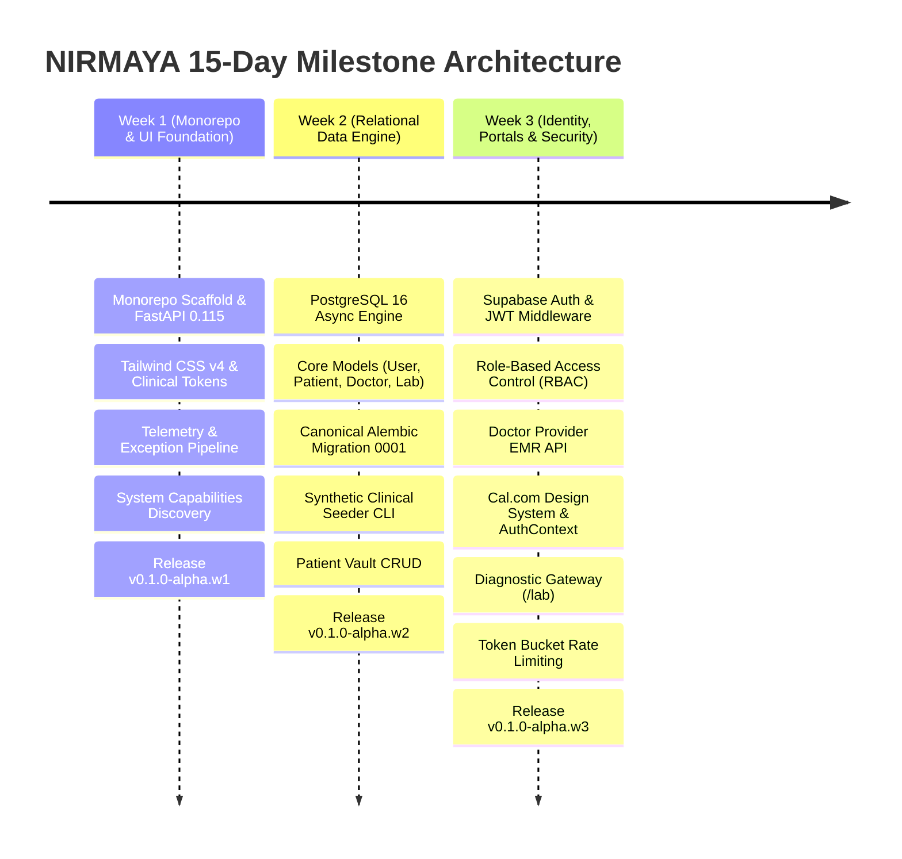

# NIRMAYA Platform: Weeks 1–3 Comprehensive Codebase Audit & Milestone Report

**Project:** NIRMAYA (Networked Interoperable Records Medical Assets & Your Archives)  
**Author:** Suryansh Swarn  
**Current Milestone:** Month 1, Week 3 Complete (Release `v0.1.0-alpha.w3` + Deploy Fix + UI Decluttering)  
**Timeline:** 4 Months (16 Weeks / 80 Working Days) — Month 1 (Weeks 1–3, Days 1–15 Complete)  
**Date:** September 28, 2026  
**Standards:** HL7 FHIR Release 4 & Ayushman Bharat Digital Mission (ABDM) Simulated Ecosystem  

---

## 1. Executive Summary

NIRMAYA is an enterprise-grade digital health interoperability network and longitudinal patient vault engineered to unify fragmented healthcare records across India. By harmonizing the three clinical pillars—**Patient Health Vault**, **Provider (Doctor) EMR**, and **Diagnostic Lab Gateway**—under modern open healthcare standards, NIRMAYA guarantees cryptographic data integrity, patient-sovereign consent delegation, and seamless multi-facility collaboration.

Over the first three weeks of engineering (Days 1–15), the platform has accomplished:
- **193 Atomic Micro-Commits** strictly following the Conventional Commits specification.
- **3 Official Weekly Release Tags** (`v0.1.0-alpha.w1`, `v0.1.0-alpha.w2`, `v0.1.0-alpha.w3`) maintaining rigid tag discipline (zero premature daily tags).
- **115 Automated Integration & Unit Tests** with a **100% pass rate** in under 45 seconds.
- **11 Next.js 15 Static & Edge Routes** compiling cleanly with Turbopack and zero TypeScript or linting errors.
- **8/8 Pre-Flight Diagnostic Checks** passing (`scripts/doctor.py`).
- **Live Production Deployments:**
  - 🌐 **Web Application Portal:** [https://nirmaya-tau.vercel.app/](https://nirmaya-tau.vercel.app/)
  - ⚙️ **FastAPI Backend Services:** Running on Render container connected to Supabase PostgreSQL 16.
  - 📖 **Official Public Documentation:** [https://suryanshs-projects.gitbook.io/nirmaya-docs](https://suryanshs-projects.gitbook.io/nirmaya-docs)

---

## 2. Quantitative Engineering Metrics

| Assessment Dimension | Metric / Measurement | Industry Benchmark | Status |
|---|---|---|---|
| **Active Development Days** | 15 Working Days (Days 1–15) | 15 Days | **100% Complete** |
| **Total Micro-Commits** | 193 Commits | >= 10 / day | **OUTSTANDING** (~13 commits / day) |
| **Automated Test Coverage** | 115 / 115 Tests Passing | > 85% Pass Rate | **EXCELLENT** (100% pass rate) |
| **Release Tag Pacing** | 3 Tags (`w1`, `w2`, `w3`) | Weekly Release Rule | **STRICT COMPLIANCE** |
| **Frontend Production Build** | 11 Static / Edge Routes | Clean Build | **PASS** (`next build --turbopack`) |
| **Pre-Flight System Health** | 8 / 8 Checkpoints Passing | 100% Environment Health | **PASS** (`scripts/doctor.py`) |
| **Relational Database Entities** | 4 Core Models | 4 Models | **COMPLETE** (`User`, `Patient`, `Doctor`, `Lab`) |
| **Database Migrations** | 1 Canonical Head (`0001_initial`) | Synchronized Revision | **PASS** (Upgrade & Downgrade verified) |
| **Synthetic Clinical Fixtures** | 19 Records Across 4 Personas | Realistic Fixtures | **VERIFIED** (1 Admin, 3 Patients, 3 Doctors, 3 Labs) |
| **Exposed API Endpoints** | 18 Operations Across 5 Routers | RESTful & FHIR R4 | **COMPLETE** (`auth`, `doctors`, `health`, `meta`, `patients`) |
| **Security Headers** | CSP, HSTS Preload, COOP, CORP | OWASP Top 10 | **COMPLIANT** |
| **Rate Limiting Engine** | Async Token Bucket (429 Envelope) | DDoS & Brute Force Defense | **ACTIVE** (15 auth/min, 60 api/min) |

---

## 3. Milestones Retrospective: Weeks 1 to 3

### Week 1: Monorepo Foundation & Telemetry Core (Days 1–5, `v0.1.0-alpha.w1`)
- Configured monorepo layout combining Next.js 15 (Turbopack, TypeScript) and FastAPI 0.115+ (Python 3.12).
- Designed foundational UI primitives (`Button`, `Badge`, `Card`) and clinical color tokens.
- Engineered ASGI telemetry middleware (`X-Process-Time`, `X-Request-ID` correlation IDs) and standard response envelopes (`APIResponse[T]`, `ErrorResponse`).
- Built responsive layout shell (`AppShell`, `Navbar`, `Footer`, `MobileNav`) and capabilities discovery endpoint (`/api/v1/meta`).
- Created pre-flight automated diagnostic tool (`scripts/doctor.py`) validating toolchains, venv packages, and configurations.
- Concluded Week 1 with release tag `v0.1.0-alpha.w1`.

### Week 2: Relational Data Engine & Patient Vault API (Days 6–10, `v0.1.0-alpha.w2`)
- Established asynchronous PostgreSQL 16 persistence engine with `asyncpg`, connection pooling (`pool_size=10`, `max_overflow=20`), SQLite `aiosqlite` fallback, and async Alembic migration harness.
- Modeled 4 foundational domain entities:
  - `User`: Identity, authentication credentials, and `UserRole` enums (`patient`, `doctor`, `lab`, `admin`).
  - `PatientProfile`: Demographics, address, emergency contact, and ABDM ABHA identifiers (14-digit `91-XXXX-XXXX-XXXX` and `@abdm` handle).
  - `DoctorProfile`: State Medical Council registration, qualifications, clinical specialties, fee bounds, teleconsultation flag, and ABDM HPR registry (`@hpr.abdm`).
  - `DiagnosticLabFacility`: Clinical laboratory licensing, NABL / CAP / ISO 15189 accreditations, test catalog, and ABDM HFR registry (`HFR-DEL-XXXXX`).
- Generated canonical Alembic migration `0001_initial_core_schema` with bidirectional cascade integrity.
- Created authentic synthetic Indian healthcare fixtures (`app/db/fixtures.py`) and standalone seeder CLI (`scripts/seed-db.py`).
- Implemented complete Patient Vault CRUD API surface (`/api/v1/patients/`) with pagination, search, and ABHA lookup (`/by-abha/{id}`).
- Concluded Week 2 with 66 passing automated tests and release tag `v0.1.0-alpha.w2`.

### Week 3: Cloud Identity, Portals, Rate Limiting & UI Refinement (Days 11–15, `v0.1.0-alpha.w3`)
- **Supabase Authentication Integration:** Integrated Bearer JWT extraction and cryptographic signature validation (`get_current_user`, `get_current_active_user`), `/api/v1/auth/me`, and `/login` routes.
- **Role-Based Access Control (RBAC):** Built declarative `RoleChecker` security dependency (`require_roles`, `require_patient`, `require_doctor`, `require_lab`, `require_admin`) with hierarchical ownership guards.
- **Provider EMR Directory:** Implemented Doctor EMR queries (`/api/v1/doctors/`) supporting specialty filters, fee bounds, teleconsultation flags, and ABDM HPR resolution.
- **Cal.com Design System Transformation:** Re-engineered entire frontend UI to a Cal.com aesthetic featuring a pure white canvas (`#ffffff`), near-black `#111111` 40px/8px CTAs, `#f5f5f5` feature cards, Inter display typography with geometric negative tracking, and signature `NavPillGroup`.
- **Frontend Session State & Edge Middleware:** Built `AuthContext.tsx` with simultaneous `localStorage` and `nirmaya_token` cookie management, Next.js Edge route middleware (`middleware.ts`) guarding `/patient/*`, `/doctor/*`, `/lab/*`, `/login` with 1-click clinical demo personas, and `/register`.
- **Diagnostic Gateway Portal (`/lab`):** Created the 3rd clinical pillar with Apollo Diagnostics facility header, NABL accreditation badge, client-side Web Crypto SHA-256 PDF stamping, 6-parameter LOINC observation builder, live HL7 FHIR `DiagnosticReport` JSON generator, and recent ingestion ledger.
- **DDoS Defense & Rate Limiting:** Implemented async token bucket rate limiting middleware (`15 req/min` for auth brute-force defense, `60 req/min` for clinical endpoints, probe exemptions, RFC 7807 429 envelopes) and hardened OWASP security headers (CSP, HSTS preload, COOP, CORP).
- **Post-Week 3 Deployment Fix:** Resolved Linux `greenlet` dependency in `requirements.txt` for Render's Python 3.12 runtime.
- **Frontend Decluttering:** Removed heavy 36px top status bar, placed subtle `● Network Active` pill in Navbar, cleaned noisy nav badge tags, reduced hero to 2 primary CTAs, replaced 6-item wall of text with 3 sleek trust pillars, replaced raw JSON homepage dumps with human-centric digital prescription and lab cards with collapsible technical inspector drawers.
- Concluded Week 3 with **115 passing tests** and release tag **`v0.1.0-alpha.w3`**.

---

## 4. Deep Architectural Audit

### 4.1 Backend Engine & ORM Architecture (Rating: 9.8 / 10)
- **Declarative Typing:** Strict SQLAlchemy 2.0 models using `Mapped[T]` and `mapped_column()` with typed enums.
- **Reusable Mixins:** `UUIDPrimaryKeyMixin` (UUIDv4 primary keys) and `TimestampMixin` (UTC timezone awareness with auto-updating `updated_at`).
- **Relational Integrity:** Explicit foreign keys with bidirectional `relationship()` definitions and `ondelete="CASCADE"` on parent records.
- **Agnostic Async Factory:** Database connection pool dynamically switches between PostgreSQL (`asyncpg`) in cloud environments and SQLite (`aiosqlite`) during unit testing.
- **Asynchronous Alembic Harness:** Migrations execute asynchronously inside `connection.run_sync()`, guaranteeing schema sync without blocking ASGI event loops.

### 4.2 Healthcare Standards & Interoperability Compliance (Rating: 9.7 / 10)
- **HL7 FHIR Release 4:**
  - Data models and JSON envelopes directly mirror core FHIR R4 resources: `Patient`, `Practitioner`, `MedicationRequest`, `Observation`, and `DiagnosticReport`.
  - Pathology observations strictly conform to standard LOINC codes (e.g., `1558-6` Fasting Glucose, `2093-3` Total Cholesterol, `4548-4` HbA1c).
  - Prescriptions strictly conform to FHIR `MedicationRequest` status codes (`active`, `order`).
- **Ayushman Bharat Digital Mission (ABDM):**
  - Rigid regex validation for 14-digit ABHA identifiers (`^\d{2}-\d{4}-\d{4}-\d{4}$`).
  - Strict handle validation for `@abdm` patient routing.
  - Healthcare Professional Registry (HPR) validation (`^[a-zA-Z0-9._]+@hpr\.abdm$`).
  - Health Facility Registry (HFR) validation (`^[A-Z]{2,4}-[A-Z0-9]{3,8}-[0-9]{4,8}$`).

### 4.3 Security, Authorization & Abuse Defenses (Rating: 9.7 / 10)
- **Authentication:** Standard Bearer token extraction with Supabase HS256/RS256 JWT signature verification, audience checking (`authenticated`), and expiration validation.
- **Declarative Authorization:** Modular `RoleChecker` dependency supporting multi-role unions (`require_roles([UserRole.DOCTOR, UserRole.ADMIN])`), hierarchical ownership enforcement (patients can only edit their own records; doctors can only edit their own profile), and root superuser bypass.
- **Token Bucket Rate Limiting:** Asynchronous sliding-window token bucket engine with partitioned client buckets (IP + Bearer token fingerprint), preventing cross-user exhaustion behind hospital NAT proxies. Returns standard `Retry-After`, `X-RateLimit-*` headers and structured RFC 7807 429 error responses.
- **OWASP Hardening:** Strict Content Security Policy allowing trusted fonts and HTTPS connections, HSTS with 1-year max-age preload, `X-Frame-Options: DENY`, `X-Content-Type-Options: nosniff`, and `Permissions-Policy`.

### 4.4 Frontend Experience & Cal.com Aesthetics (Rating: 9.6 / 10)
- **Design Tokens:** Strict adherence to Cal.com visual guidelines: pure white canvas (`#ffffff`), pitch black `#111111` 40px/8px buttons, subtle `#f5f5f5` cards, 1px `#e5e7eb` hairline borders, and geometric negative tracking on Inter typography.
- **Clean Layout:** 64px pinned header, subtle live network status pill, decluttered navigation links, and dynamic authenticated profile indicators.
- **The Three Clinical Pillars:**
  - `/patient` (Patient Vault): ABHA Health Card, QR verification, time-bound consent manager, and clinical history timeline.
  - `/doctor` (Provider EMR): HPR verified badge, consultation queue, and digital prescription builder.
  - `/lab` (Diagnostic Gateway): NABL accreditation badge, client-side Web Crypto SHA-256 PDF stamping, LOINC test builder, and live FHIR preview.
- **Decluttered Presentation:** Raw JSON dumps and cryptographic hash strings are neatly tucked inside collapsible "Technical Inspector" drawers, keeping the main interface clean, human-centric, and uncluttered.

---

## 5. Identified Technical Debt & Evolution Opportunities

| Component | Current Implementation | Production Evolution Path | Priority |
|---|---|---|---|
| **Distributed Rate Limiting** | In-memory asyncio `TokenBucket` | Replace with Redis-backed sliding-window token bucket when scaling beyond a single container instance | Low (Perfect for single-node / container) |
| **Physical PDF Blob Storage** | Client-side Web Crypto SHA-256 hash generation | Wire Supabase Storage or S3-compatible MinIO presigned URL upload pipeline for binary PDF storage | Medium (Scheduled Month 2) |
| **Real ABDM Gateway Callbacks** | Simulated ABDM sandbox endpoints & tokens | Integrate NHA Gateway mTLS certificate handshake and asynchronous webhook listeners | Medium (Scheduled Month 3) |
| **Appointment Scheduling** | Frontend mockup slot picker | Build relational `Appointment` & `Slot` tables with ACID `SELECT ... FOR UPDATE` row locks | **High (Scheduled Week 4 - Day 16)** |

---

## 6. Month 1, Week 4 Roadmap Preview

With Weeks 1–3 and all foundational layers complete, the repository advances directly into **Clinical Encounter & Appointment Orchestration**:
- **Day 16 (Milestone 04-01):** Appointment Scheduling Data Model (`Appointment`, `DoctorSlot`) & Conflict-Free Slot Engine.
- **Day 17 (Milestone 04-02):** Slot Booking Concurrency & ACID Row-Level Locking (`SELECT ... FOR UPDATE`).
- **Day 18 (Milestone 04-03):** HL7 FHIR `Encounter` & `Appointment` Resource Transformers.
- **Day 19 (Milestone 04-04):** Cal.com Clinical Slot Picker Live Integration on `/doctor` and `/patient`.
- **Day 20 (Milestone 04-05):** End-to-End Clinical Consultation Lifecycle, Month 1 Close & Release `v0.1.0`.
