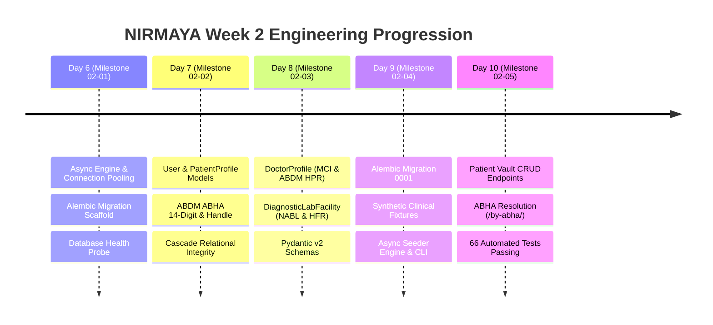

# Week 2 Retrospective: Relational Modeling, Migrations & Patient Vault API

**Date:** September 17, 2026  
**Period:** Month 1, Week 2 (Days 6–10)  
**Milestone Version:** `v0.1.0-alpha.w2` (Closing Week 2)  
**Author:** Suryansh Swarn  

---

## 1. Executive Summary

Week 2 transitions NIRMAYA from monorepo and UI scaffolding into a **robust, enterprise-grade relational data persistence engine and clinical service platform**. Over the course of 5 working days (Days 6–10), the repository advanced by **50+ atomic micro-commits**, establishing:
1. Production-grade asynchronous database architecture (SQLAlchemy 2.0 async engine, connection pooling, and Alembic migrations).
2. Four core domain entities: `User` (RBAC & Supabase mapping), `PatientProfile` (ABDM ABHA integration), `DoctorProfile` (MCI licensing & ABDM HPR registry), and `DiagnosticLabFacility` (NABL/CAP accreditations & ABDM HFR registry).
3. A canonical initial schema migration (`0001_initial_core_schema`) with verified upgrade and downgrade mechanics.
4. An idempotent synthetic clinical fixtures seeder (`scripts/seed-db.py`) populated with authentic Indian healthcare records across 4 persona archetypes.
5. The first clinical REST API surface: **Patient Vault CRUD (`/api/v1/patients`)** with pagination, query search, and ABHA identifier resolution.
6. A backend automated test suite expanded to **66 passing tests (100% pass rate)**.

---

## 2. Quantitative Engineering Metrics

| Metric | Measurement | Target | Status |
|---|---|---|---|
| **Active Development Days** | 5 Days (Days 6–10) | 5 Days | 100% Complete |
| **Total Micro-Commits** | 50+ Commits | >= 10 / day | Exceeded (99 total repository commits) |
| **Automated Pytest Coverage** | 66 Tests Passing | 100% Pass Rate | 100% (17.15s runtime) |
| **Relational Database Entities** | 4 Core Models | 4 Models | Complete (`User`, `Patient`, `Doctor`, `Lab`) |
| **Database Migrations** | 1 Canonical Revision | Head Synchronized | Complete (`0001_initial_core_schema`) |
| **Synthetic Seed Fixtures** | 19 Records Across 4 Personas | Realistic Fixtures | Verified (1 Admin, 3 Patients, 3 Doctors, 3 Labs) |
| **Pre-flight Diagnostics** | 8/8 Checks Passed | 0 Errors | Verified (`scripts/doctor.py`) |
| **Weekly Tag Status** | `v0.1.0-alpha.w2` | Weekly Tag Rule | Tagged & Pushed |

---

## 3. Daily Milestones Recap

### Day 6 — Async Engine, Connection Pooling & Alembic Scaffold
- Configured PostgreSQL 16 asynchronous engine with `asyncpg` and SQLite `aiosqlite` fallback.
- Implemented pool settings (`DATABASE_POOL_SIZE=10`, `DATABASE_MAX_OVERFLOW=20`, `pool_pre_ping=True`).
- Setup asynchronous Alembic migration environment (`backend/alembic/`) with `run_async_migrations()`.
- Built live database health probe (`/api/v1/health`) measuring connectivity latency in milliseconds.

### Day 7 — Core Relational Entities: User, Role & PatientProfile with ABHA
- Created foundational clinical enums: `UserRole`, `Gender` (HL7 FHIR aligned), and `BloodGroup`.
- Implemented `User` entity with unique email, phone number, role, and Supabase UID mapping.
- Implemented `PatientProfile` with demographics, residential address, emergency contact, and ABDM ABHA identifiers (`abha_number` in `91-XXXX-XXXX-XXXX` and `abha_address` in `<username>@abdm`).
- Configured bidirectional 1-to-1 cascade deletion (`ondelete="CASCADE"`).

### Day 8 — Provider & Diagnostic Entities: DoctorProfile & DiagnosticLabFacility
- Implemented `DoctorProfile` capturing State Medical Council registration, qualifications (MBBS, MD, DM), clinical specialties, consultation fee, teleconsultation flag, and ABDM Healthcare Professional Registry (`hpr_id`).
- Implemented `DiagnosticLabFacility` capturing clinical laboratory licenses, NABL / CAP / ISO 15189 accreditations, facility address, test catalog, and ABDM Health Facility Registry (`hfr_id`).
- Created Pydantic v2 schemas enforcing strict regex patterns for `@hpr.abdm` and `IN-STATE-HFR-XXXXXX`.

### Day 9 — Initial Alembic Migrations, Indexes & Synthetic Clinical Fixtures
- Generated canonical Alembic migration `0001_initial_core_schema` with full `upgrade()` and `downgrade()` cycles.
- Created authentic synthetic Indian healthcare data fixtures in `backend/app/db/fixtures.py`.
- Built idempotent asynchronous database seeder service (`app/db/seeder.py`) and standalone CLI tool (`scripts/seed-db.py`).
- Integrated migration discovery and seeder CLI checks into `scripts/doctor.py`.

### Day 10 — Patient Vault Profile CRUD API & Integration Tests
- Constructed modular business logic service layer in `backend/app/services/patient.py`.
- Exposed complete Patient Vault REST API surface (`/api/v1/patients/`): create, paginated list, get by UUID, update, and delete.
- Built specialized ABDM interoperability resolution endpoint (`/api/v1/patients/by-abha/{identifier}`).
- Delivered comprehensive test suite expanding automated test count to **66 passing tests**.

---

## 4. Architectural Lessons & Engineering Decisions

1. **Service Layer Separation:**
   - *Problem:* Direct ORM querying in FastAPI route handlers creates coupling and complicates unit testing.
   - *Resolution:* Introduced `backend/app/services/patient.py` containing pure asynchronous database interactions, enabling clean separation of concerns and deterministic transaction boundaries.

2. **Async Greenlet Lazy-Loading Resolution:**
   - *Problem:* In SQLAlchemy 2.0 async, accessing un-loaded relationships on an ORM instance outside an active greenlet triggers `MissingGreenlet: greenlet_spawn has not been called`.
   - *Resolution:* Standardized on `selectinload(Model.relationship)` across all service queries and integration test assertions.

3. **Circular Import Protection:**
   - *Problem:* Eager module loading in `app/db/__init__.py` caused circular dependency when importing models that subclass `app.db.base.Base`.
   - *Resolution:* Decoupled model imports within `app/db/seeder.py` to function scopes, ensuring zero cyclic dependencies across package initializations.

---

## 5. Looking Ahead: Week 3 Preview (Authentication, RBAC & Security)

With relational models, migrations, and the Patient Vault CRUD API fully established, Week 3 focuses on **Authentication, Identity Verification, and Access Control**:

- **Day 11 (Milestone 03-01):** Supabase Auth JWT verification middleware, token decode utilities, and claims validation.
- **Day 12 (Milestone 03-02):** Role-Based Access Control (RBAC) security dependencies (`require_role(UserRole.DOCTOR)`, `require_role(UserRole.PATIENT)`).
- **Day 13 (Milestone 03-03):** User registration and login endpoints, OAuth callbacks, and user profile sync with Supabase Auth.
- **Day 14 (Milestone 03-04):** Frontend Supabase Auth client integration, protected route middleware, and session persistence.
- **Day 15 (Milestone 03-05):** Security audit, rate limiting middleware, OWASP compliance verification, and Week 3 Close.
