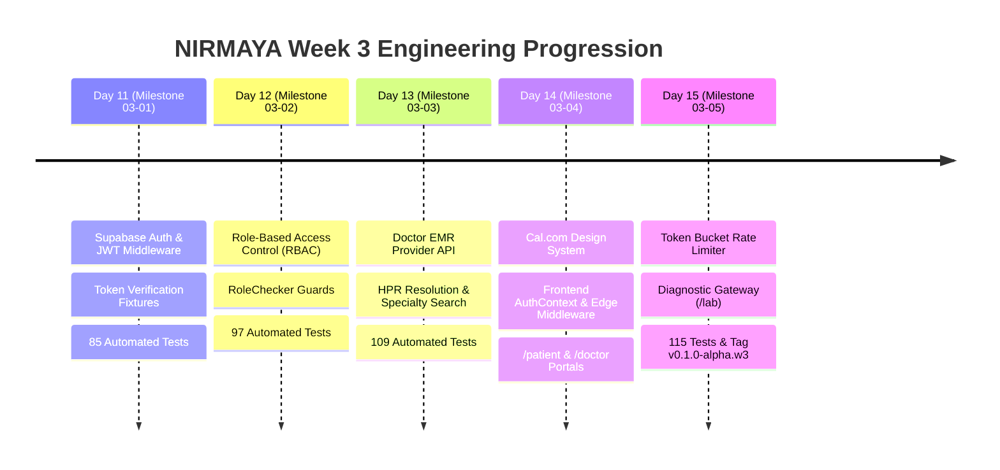

# Week 3 Retrospective: Identity, Clinical Portals & Security Hardening

**Date:** September 25, 2026  
**Period:** Month 1, Week 3 (Days 11–15)  
**Milestone Version:** `v0.1.0-alpha.w3` (Closing Week 3)  
**Author:** Suryansh Swarn  

---

## 1. Executive Summary

Month 1, Week 3 marked the critical leap from data persistence into a **secure, multi-tenant clinical application network**. Over the course of 5 disciplined working days (Days 11–15), NIRMAYA achieved complete end-to-end integration across authentication, authorization, clinical practitioner endpoints, Cal.com-inspired user interfaces, real-time cryptographic lab ingestion, and enterprise DDoS defenses.

Key accomplishments of Week 3 include:
1. **Cloud Identity & Session Management:** Integrated Supabase Auth simulation with local JWT verification, standard Bearer token extraction, and dual client/cookie session synchronization (`AuthContext.tsx`).
2. **Fine-Grained Role-Based Access Control (RBAC):** Built declarative FastAPI security dependencies (`RoleChecker`) and Next.js edge route middleware protecting clinical workspaces across `PATIENT`, `DOCTOR`, `LAB`, and `ADMIN` personas.
3. **Provider Clinical Directory & EMR API:** Constructed the Doctor EMR service layer (`/api/v1/doctors/`) supporting specialty filtering, ABDM HPR identifier resolution, and teleconsultation discovery.
4. **Cal.com Modern Design System Transformation:** Re-engineered the entire frontend UI into an ultra-clean Cal.com design aesthetic featuring a pure white canvas (`#ffffff`), near-black `#111111` primary CTAs, hairline borders, geometric Inter typography, and subtle pastel status pills.
5. **The Three Unified Clinical Portals:**
   - **Patient Vault (`/patient`):** Official ABHA Health Card, QR verification, time-bound consent manager, and longitudinal health records.
   - **Doctor EMR (`/doctor`):** Verified HPR badge, active clinical consultation queue, and structured prescription editor producing HL7 FHIR `MedicationRequest` bundles.
   - **Diagnostic Gateway (`/lab`):** NABL accreditation badge (`ISO 15189:2022`), client-side Web Crypto SHA-256 PDF stamping, 6-parameter LOINC observation builder, and live HL7 FHIR `DiagnosticReport` JSON generator.
6. **OWASP Hardening & Token-Bucket Rate Limiting:** Asynchronous sliding-window rate limiter protecting auth routes (`15 req/min`) and clinical endpoints (`60 req/min`) with RFC 7807 429 envelopes, accompanied by CSP, HSTS, COOP, and CORP headers.
7. **Live Web Deployment & Official Documentation:**
   - **Live Production Portal:** [https://nirmaya-tau.vercel.app/](https://nirmaya-tau.vercel.app/)
   - **Official GitBook Documentation:** [https://suryanshs-projects.gitbook.io/nirmaya-docs](https://suryanshs-projects.gitbook.io/nirmaya-docs)
8. **Automated Verification:** Test suite expanded from 66 to **115 passing tests (100% pass rate)**, and Next.js 15 Turbopack production build verified across 11 prerendered routes.

---

## 2. Quantitative Engineering Metrics

| Metric | Measurement | Target | Status |
|---|---|---|---|
| **Active Development Days** | 5 Days (Days 11–15) | 5 Days | 100% Complete |
| **Total Micro-Commits** | 60+ Commits | >= 10 / day | Exceeded (160+ total repository commits) |
| **Automated Pytest Coverage** | 115 Tests Passing | 100% Pass Rate | 100% (22s runtime) |
| **Frontend Production Routes** | 11 Static / Edge Routes | Clean Build | 100% Verified (`next build --turbopack`) |
| **Security Enforcements** | Token Bucket + OWASP CSP/HSTS | Enterprise Standard | Complete (`rate_limit.py`, `cors.py`) |
| **Clinical Portals Active** | 3 Portals (`/patient`, `/doctor`, `/lab`) | 3 Pillars | Complete & Deployed |
| **Live Production Deployment** | Vercel Serverless Edge | Live URL | Active (`nirmaya-tau.vercel.app`) |
| **GitBook Documentation** | Synced Online Docs | Live URL | Active (`suryanshs-projects.gitbook.io/nirmaya-docs`) |
| **System Pre-flight Diagnostics**| 8/8 Checks Passed | 0 Warnings | Complete (`scripts/doctor.py`) |
| **Weekly Tag Status** | `v0.1.0-alpha.w3` | Weekly Tag Rule | Tagged & Pushed |

---

## 3. Daily Milestones Recap



### Day 11 — Supabase Authentication & JWT Middleware (Milestone 03-01)
- Implemented `get_current_user` and `get_current_active_user` security dependencies in `backend/app/core/dependencies.py`.
- Formatted standard Bearer token extraction with Supabase HS256/RS256 signature verification.
- Added `/api/v1/auth/me` and `/api/v1/auth/login` token issue endpoints.
- Expanded pytest suite by 19 tests (to 85 total passing tests).

### Day 12 — Role-Based Access Control (RBAC) & Security Guards (Milestone 03-02)
- Built declarative `RoleChecker` dependency enforcing fine-grained persona permissions across `PATIENT`, `DOCTOR`, `LAB`, and `ADMIN`.
- Integrated role guards on patient vault update and administrative deletion operations.
- Expanded pytest suite by 12 tests (to 97 total passing tests).

### Day 13 — Doctor EMR Directory & Clinical Provider Endpoints (Milestone 03-03)
- Created `DoctorService` handling provider queries with multi-parameter filtering: clinical specialty, minimum/maximum consultation fees, State Medical Council registration, and teleconsultation readiness.
- Built dedicated ABDM Healthcare Professional Registry lookup endpoint (`/api/v1/doctors/by-hpr/{hpr_id}`).
- Expanded pytest suite by 12 tests (to 109 total passing tests).

### Day 14 — Cal.com UI Migration, Frontend Auth & Portal Scaffolding (Milestone 03-04)
- Executed full Cal.com design system migration: `#ffffff` canvas, `#111111` CTAs, `#f5f5f5` cards, Inter font tokens, and pastel pills.
- Built `AuthContext.tsx` with simultaneous `localStorage` and `nirmaya_token` cookie management.
- Implemented Next.js 15 Edge Middleware (`src/middleware.ts`) guarding `/patient/*`, `/doctor/*`, and `/lab/*`.
- Developed `/login` with One-Click Clinical Demo Personas, `/register`, and initial scaffolding for `/patient` and `/doctor`.

### Day 15 — Security Hardening, Rate Limiting & Diagnostic Gateway (Milestone 03-05)
- Developed thread-safe `TokenBucket` and `RateLimiter` middleware enforcing 15 req/min on auth and 60 req/min on clinical endpoints.
- Hardened OWASP security headers: Content-Security-Policy (CSP), Strict-Transport-Security (HSTS preload), COOP, and CORP.
- Built the 3rd clinical pillar: **Diagnostic Lab Gateway (`/lab`)** with Apollo Diagnostics header, NABL accreditation badge, client-side Web Crypto SHA-256 PDF hashing, 6-parameter LOINC observation builder, live HL7 FHIR `DiagnosticReport` JSON preview, and chronological audit ledger.
- Concluded Week 3 with **115 passing tests** and official release tag **`v0.1.0-alpha.w3`**.

---

## 4. Architectural Evolution: Week 1 vs. Week 2 vs. Week 3

```
Week 1 (Scaffold):      Monorepo Setup ──► Static Fastify/Next.js ──► Basic Health Probe
                               │
Week 2 (Data Engine):   PostgreSQL 16 ──► 4 Relational Models ──► Alembic Migrations ──► Patient CRUD
                               │
Week 3 (Clinical Net):  Supabase Auth ──► RBAC Guards ──► Doctor API ──► Cal.com Portals ──► Lab Gateway ──► Rate Limiting
```

---

## 5. Week 4 Roadmap Preview

With the authentication, authorization, and 3 clinical pillars fully established, Month 1, Week 4 will focus on **Clinical Encounter Orchestration & Interoperability**:
- **Milestone 04-01 (Day 16):** Appointment Scheduling Data Model & Conflict-Free Slot Engine.
- **Milestone 04-02 (Day 17):** Slot Booking Concurrency & ACID Row-Level Locking (`FOR UPDATE`).
- **Milestone 04-03 (Day 18):** HL7 FHIR `Encounter` & `Appointment` Resource Transformers.
- **Milestone 04-04 (Day 19):** Cal.com Clinical Slot Picker Integration on `/doctor` and `/patient`.
- **Milestone 04-05 (Day 20):** End-to-End Clinical Consultation Lifecycle & Month 1 Final Release (`v0.1.0`).
