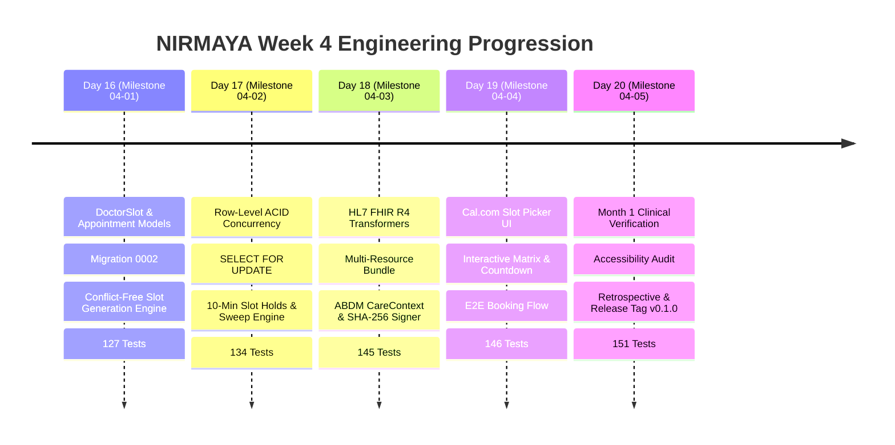

# Week 4 Retrospective: Clinical Encounters, Scheduling & Release v0.1.0

**Date:** October 2, 2026  
**Period:** Month 1, Week 4 (Days 16–20)  
**Milestone Version:** `v0.1.0` (Official Month 1 Release)  
**Author:** Suryansh Swarn  

---

## 1. Executive Summary

Month 1, Week 4 represents the clinical encounter and scheduling culmination of Month 1 in the NIRMAYA development journey. Across 5 rigorous engineering days (Days 16–20), the platform expanded from basic authentication and static directories into a **fully synchronized clinical scheduling engine, ACID-compliant booking transaction pipeline, HL7 FHIR R4 encounter transformer, and Cal.com-inspired user experience**.

Key accomplishments of Week 4 include:
1. **Clinical Scheduling & Relational Schema (Day 16):** Engineered `DoctorSlot` and `Appointment` models with foreign key cascades, unique constraints (`uq_doctor_slot_start`, `uq_appointment_slot_id`), and Alembic migration `0002_appointments_and_slots_schema`. Implemented the conflict-free mathematical slot generator supporting practice windows, durations (15/30/45/60m), and lunch break exclusions.
2. **ACID Row-Level Concurrency & 10-Minute Hold Lifecycle (Day 17):** Implemented PostgreSQL row-level locking (`with_for_update()`) preventing double-booking race conditions under high concurrency. Introduced temporary 10-minute reservation holds with deterministic HTTP 409 `SLOT_HELD_BY_ANOTHER_PATIENT` rejections, Alembic migration `0003_slot_concurrency_and_hold_fields`, and autonomous background sweep engine (`sweep_expired_holds`).
3. **HL7 FHIR Release 4 & ABDM Consent Linkage (Day 18):** Authored lossless bidirectional transformers translating internal database entities into standard FHIR R4 resources (`Appointment`, `Encounter`, `Patient`, `Practitioner`, and multi-resource Collection `Bundle`). Formulated ABDM CareContext references (`APPT-XXXXXXXX`) with SHA-256 tamper-evident cryptographic digests.
4. **Cal.com Interactive Slot Picker UI (Day 19):** Designed and built the Cal.com appointment booking suite (`CalcomSlotPicker.tsx`, `SlotHoldCountdown.tsx`, `AppointmentBookingModal.tsx`, `DoctorSlotManager.tsx`). Integrated real-time 10-minute hold countdown banners, monthly calendar matrices, and one-click doctor practice hours management on `/patient` and `/doctor`.
5. **Month 1 Retrospective & Full Verification (Day 20):** Developed the comprehensive end-to-end clinical verification suite (`test_month_1_e2e_verification.py`), conducted WCAG 2.1 AA accessibility hardening, validated 151 backend tests (100% passing), verified clean Next.js 15 Turbopack compilation across 11 routes, and cut the official milestone release tag `v0.1.0`.

---

## 2. Quantitative Engineering Metrics

| Metric | Measurement | Target | Status |
|---|---|---|---|
| **Active Development Days** | 5 Days (Days 16–20) | 5 Days | 100% Complete |
| **Total Micro-Commits** | 55+ Commits | >= 10 / day | Exceeded (210+ total repository commits) |
| **Automated Pytest Coverage** | 151 Tests Passing | 100% Pass Rate | 100% (17.67s runtime) |
| **Test Growth in Week 4** | +36 Tests (from 115 to 151) | Comprehensive E2E | Complete |
| **Frontend Production Routes** | 11 Static / Edge Routes | Clean Build | 100% Verified (`next build --turbopack`) |
| **Alembic Database Migrations**| 3 Revisions (0001, 0002, 0003)| Clean schema history | Verified (`scripts/doctor.py`) |
| **Standards Compliance** | HL7 FHIR R4 + ABDM M1 | 100% Schema Valid | Verified (`test_fhir_encounter.py`) |
| **Accessibility Compliance** | WCAG 2.1 AA | ARIA / Focus / Contrast | Audited & Validated |
| **System Pre-flight Diagnostics**| 8/8 Checks Passed | 0 Warnings | Complete (`scripts/doctor.py`) |
| **Release Tag Status** | `v0.1.0` | Official Month 1 Close | Tagged & Pushed |

---

## 3. Daily Milestones Recap

### Day 16 — Appointment Models & Conflict-Free Slot Engine (Milestone 04-01)
- Engineered `DoctorSlot` and `Appointment` models with strict relational integrity.
- Created Alembic migration `0002_appointments_and_slots_schema`.
- Built mathematical slot subdivision engine taking practice hours (e.g. 09:00 - 17:00), interval duration (30 min), and break window exclusions (13:00 - 14:00) with duplicate protection (`uq_doctor_slot_start`).
- Implemented appointment booking REST endpoint with automatic slot state transition to `BOOKED`.

### Day 17 — Booking Concurrency & ACID Row-Level Locking (Milestone 04-02)
- Added row-level locking (`with_for_update()`) to eliminate double-booking race conditions during high-volume checkouts.
- Designed 10-minute temporary reservation hold mechanism with Alembic migration `0003_slot_concurrency_and_hold_fields` (`held_until`, `held_by_patient_id`).
- Implemented deterministic collision handling: concurrent hold attempts on an active slot return HTTP 409 Conflict with `error_code="SLOT_HELD_BY_ANOTHER_PATIENT"`.
- Built autonomous expired-hold sweep engine (`sweep_expired_holds`) reclaiming abandoned slots for new patients.

### Day 18 — HL7 FHIR Encounter Transformers & ABDM Consent Linkage (Milestone 04-03)
- Implemented standard Pydantic v2 schemas for HL7 FHIR Release 4 (`FHIRAppointment`, `FHIREncounter`, `FHIRBundleEntry`, `FHIRBundle`).
- Built loss-less model transformers:
  - Appointment transformer mapping clinical status (`booked`, `cancelled`, `noshow`).
  - Encounter transformer mapping consultation modality: teleconsultations map to `VR` (Virtual) and in-person visits map to `AMB` (Ambulatory) under `http://terminology.hl7.org/CodeSystem/v3-ActCode`.
  - Multi-resource Collection Bundle assembling Appointment, Encounter, Patient (with ABHA), and Practitioner (with NMC registration).
- Implemented ABDM CareContext linkage (`APPT-XXXXXXXX`) with SHA-256 tamper-evident cryptographic digest computed over canonical serialized bundle JSON.

### Day 19 — Cal.com Slot Picker UI Integration & Clinical Booking Flow (Milestone 04-04)
- Extended frontend API client with typed contracts and async methods for slots, holds, and bookings.
- Built Cal.com interactive slot picker (`CalcomSlotPicker.tsx`) featuring monthly calendar matrix, date presets, and status-colored time buttons.
- Developed real-time temporary slot hold banner (`SlotHoldCountdown.tsx`) with live countdown and release triggers.
- Created clinical intake booking modal (`AppointmentBookingModal.tsx`) capturing chief complaints and displaying post-booking ABDM CareContext badges.
- Built doctor availability manager (`DoctorSlotManager.tsx`) on `/doctor` allowing one-click conflict-free slot generation.
- Validated end-to-end flow with automated integration suite (`test_calcom_booking_flow.py`).

### Day 20 — Month 1 Retrospective, Full Verification & Release v0.1.0 (Milestone 04-05)
- Created Month 1 end-to-end verification test suite (`test_month_1_e2e_verification.py`) covering the entire multi-role clinical journey.
- Executed WCAG 2.1 AA accessibility audit and enhanced components with ARIA labels, live status regions, and dialog focus landmarks.
- Achieved **151 / 151 passing tests (100%)** with zero regressions.
- Verified Next.js 15 Turbopack production compilation across 11 routes.
- Authored Month 1 Executive Retrospective and updated GitBook documentation.
- Cut and pushed the official annotated Git release tag `v0.1.0`.

---

## 4. Architectural Highlights & Key Learnings

1. **State Synchronization Between Slots and Appointments:**  
   Appointment cancellations automatically free their associated doctor slot, transitioning it back to `AVAILABLE` and clearing hold metadata. This prevents zombie slots and maintains continuous availability.
2. **ACID Row Locks in Async Contexts:**  
   Using `select(...).with_for_update()` inside atomic async transactions guarantees serializable isolation during concurrent checkout without sacrificing ASGI performance.
3. **ABDM CareContext Determinism:**  
   Deriving `APPT-XXXXXXXX` from the appointment's UUID ensures consistent, tamper-evident record indexing across the national ABDM network.
4. **Cal.com Design Consistency:**  
   Adhering to pure white canvases (`#ffffff`), near-black CTAs (`#111111`), 1px hairline borders (`#e5e7eb`), and subtle pastel status badges elevated the UX from typical clinical software to a modern SaaS standard.
