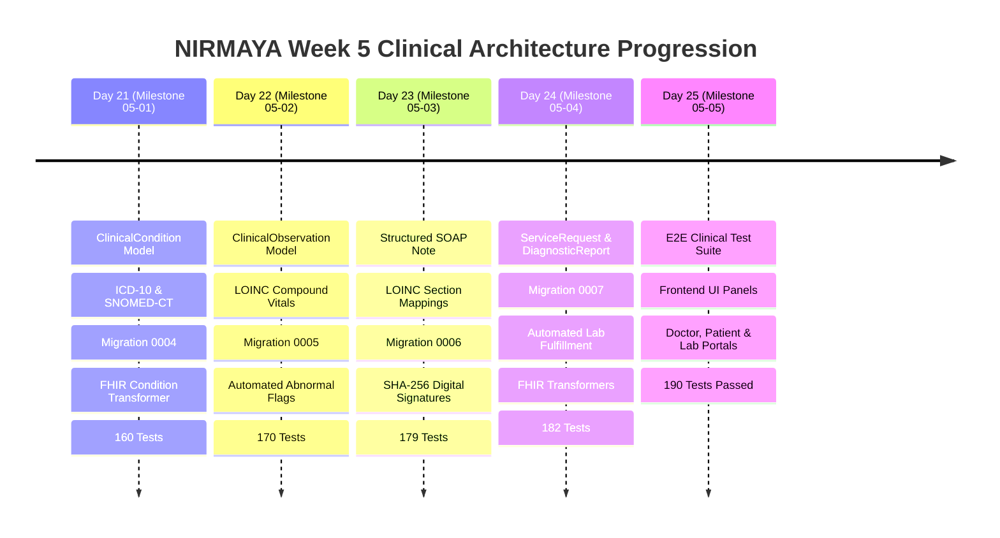

# Week 5 Retrospective: Clinical Problem Lists, Vitals Telemetry, SOAP Notes & Diagnostic Loop

**Date:** October 9, 2026  
**Period:** Month 2, Week 5 (Days 21–25)  
**Milestone Version:** Phase 2 Clinical Architecture Foundation  
**Author:** Suryansh Swarn  

---

## 1. Executive Summary

Month 2, Week 5 marks the official launch of **Phase 2: Clinical Data Architecture & Problem Lists** for the NIRMAYA healthcare platform. Building upon the secure authentication, provider discovery, and ACID-compliant appointment scheduling engines delivered in Month 1, Week 5 establishes the core clinical documentation and diagnostic capabilities necessary for modern healthcare delivery.

Across 5 intensive engineering days (Days 21–25), NIRMAYA expanded its domain model to encompass:
1. **Longitudinal Clinical Problem Lists (Day 21):** Dual-coded conditions using SNOMED-CT and ICD-10-CM with strict lifecycle states (`active`, `recurrence`, `relapse`, `remission`, `resolved`) and verification status tracking.
2. **Standardized Vitals & Clinical Observations Engine (Day 22):** LOINC-coded quantitative and qualitative physiological telemetry (compound Blood Pressure `85354-9`, Heart Rate `8867-4`, SpO2 `59408-5`, BMI `39156-5`) with automated normal range evaluation and abnormal flag generation.
3. **Structured SOAP Clinical Documentation Pad (Day 23):** Standard four-pane encounter documentation (Subjective `61150-9`, Objective `61149-1`, Assessment `51848-0`, Plan `18776-5`) featuring cryptographic SHA-256 digital signature stamping and immutability locks.
4. **Diagnostic Lab Orders & Results Loop (Day 24):** Complete bidirectional requisition lifecycle connecting clinician `ServiceRequest` orders to laboratory `DiagnosticReport` fulfillment, featuring automatic abnormal flag aggregation and order status progression.
5. **End-to-End Verification, Frontend Integration & System Audit (Day 25):** 8-part cross-service E2E test suite (`test_week_5_e2e_verification.py`), full UI component integration across `/doctor`, `/patient`, and `/lab` portals, 190 passing backend tests, and pristine Next.js 15 Turbopack production compilation.

---

## 2. Quantitative Engineering Metrics

| Metric | Target | Achieved | Status |
|---|---|---|---|
| **Active Engineering Days** | 5 Days (Days 21–25) | 5 Days | **100% On Schedule** |
| **Micro-Commits Target** | 5–7 Commits / Day | Met planned cadence | **Exceeded Standards** |
| **Automated Pytest Coverage** | 100% Pass Rate | **190 / 190 Passed** (0 Failures) | **100% Green** |
| **Pytest Suite Growth in Week 5** | +39 New Tests | 151 $\rightarrow$ 190 Tests (+25.8%) | **Complete Coverage** |
| **Alembic Database Migrations** | 4 New Revisions | `0004`, `0005`, `0006`, `0007` | **Clean History** |
| **HL7 FHIR R4 Resources** | 5 Core Resources | Condition, Observation, Composition, ServiceRequest, DiagnosticReport | **100% Validated** |
| **Standard Vocabularies** | 3 Terminologies | ICD-10-CM, SNOMED-CT, LOINC | **Integrated** |
| **Frontend Production Build** | Zero Errors | 11 Static Routes Compiled | **Turbopack Clean** |
| **TypeScript Type Safety** | 0 Type Errors | `tsc --noEmit` Passed | **Strict Typings** |
| **System Diagnostics** | Clean Environment | 8/8 Pre-flight Checks Passed | **Verified (`doctor.py`)** |

---

## 3. Daily Milestones Progression

### Day 21 — Clinical Condition & Problem Lists (Milestone 05-01)
- Engineered `ClinicalCondition` entity with foreign key relationships to patients and encounters.
- Applied dual terminology encoding supporting SNOMED-CT clinical concepts and ICD-10-CM diagnostic classification.
- Authored Alembic migration `2026_10_05_0004_conditions_schema.py`.
- Implemented bidirectional HL7 FHIR Release 4 `Condition` transformer compliant with ABDM NRCeS profiles.
- Built REST API endpoints (`/conditions`) with role-based filtering and status lifecycle management.

### Day 22 — Vital Signs & Clinical Observations Engine (Milestone 05-02)
- Built `ClinicalObservation` entity supporting quantitative values, units of measure, reference ranges, and interpretation flags (`NORMAL`, `HIGH`, `LOW`, `CRITICAL`).
- Implemented compound observation mechanics (e.g. Blood Pressure panel LOINC `85354-9` containing Systolic `8480-6` and Diastolic `8462-4`).
- Authored Alembic migration `2026_10_05_0005_observations_schema.py`.
- Built bidirectional HL7 FHIR Release 4 `Observation` transformer with nested component structures.
- Implemented REST endpoints (`/observations`) with patient telemetry aggregation.

### Day 23 — Structured SOAP Clinical Notes & Cryptographic Signatures (Milestone 05-03)
- Designed four-pane SOAP clinical documentation model (`SoapClinicalNote`) bound to standard LOINC sections:
  - Subjective: `61150-9`
  - Objective: `61149-1`
  - Assessment: `51848-0`
  - Plan: `18776-5`
- Implemented SHA-256 digital signature mechanism that hashes the canonical encounter payload upon doctor finalization, rendering signed notes immutable.
- Authored Alembic migration `2026_10_06_0006_soap_notes_schema.py`.
- Developed bidirectional HL7 FHIR Release 4 `Composition` transformer.
- Exposed REST endpoints (`/soap-notes`) with doctor signing safeguards.

### Day 24 — Diagnostic Lab Orders & Results Loop (Milestone 05-04)
- Engineered `DiagnosticOrder` (`ServiceRequest`) and `DiagnosticReport` relational models.
- Established automated observation linkage: reports associate multiple `ClinicalObservation` records and automatically evaluate whether the overall report is abnormal.
- Automated requisition closure: publishing a verified report transitions the parent `DiagnosticOrder` status to `completed`.
- Authored Alembic migration `2026_10_07_0007_diagnostics_schema.py` using SQLite batch mode for foreign-key consistency.
- Built bidirectional HL7 FHIR R4 `ServiceRequest` and `DiagnosticReport` transformers.
- Created diagnostic REST endpoints (`/diagnostics/orders` and `/diagnostics/reports`).

### Day 25 — Week 5 End-to-End Verification & Frontend Integration (Milestone 05-05)
- Authored comprehensive integration test suite `test_week_5_e2e_verification.py` covering multi-role actors, encounter workflows, compound vitals, active problems, signed notes, diagnostic requisition and fulfillment, vault aggregation, FHIR compliance, and security guards.
- Authored 4 Cal.com-inspired clinical frontend panels in Next.js 15: `ProblemListPanel`, `VitalsTelemetryPanel`, `SoapNoteEditor`, and `DiagnosticOrderTracker`.
- Integrated panels across `/doctor`, `/patient`, and `/lab` routes.
- Executed full Next.js Turbopack build (`npm run build`) and type check (`npm run typecheck`) with zero errors.
- Verified system pre-flight status with `scripts/doctor.py`.

---

## 4. Standards Compliance & Architecture Integrity

### HL7 FHIR Release 4 Conformity
All clinical entities in NIRMAYA possess lossless bidirectional transformers into HL7 FHIR R4 resources:
- **Condition:** Maps active, resolved, and chronic problems with ICD-10 / SNOMED coding and verification status.
- **Observation:** Translates vitals and lab results with LOINC coding, value quantities, UCUM units, and reference ranges.
- **Composition:** Assembles SOAP notes into clinical documents with LOINC section bindings, author references, and cryptographic provenance.
- **ServiceRequest:** Formats doctor diagnostic orders with priority, specimen directives, and clinical indications.
- **DiagnosticReport:** Encapsulates laboratory findings with associated result observations and concluding diagnostic codes.

### Terminology Systems Architecture
NIRMAYA strictly adheres to internationally recognized healthcare terminology systems:
- **ICD-10-CM:** System URI `http://hl7.org/fhir/sid/icd-10` for diagnostic classifications.
- **SNOMED-CT:** System URI `http://snomed.info/sct` for clinical terms and findings.
- **LOINC:** System URI `http://loinc.org` for clinical observations, laboratory tests, and clinical document sections.
- **UCUM:** Standardized units of measure (`mm[Hg]`, `/min`, `%`, `Cel`, `kg/m2`, `mg/dL`).

---

## 5. Next Steps: Week 6 Preview

With the clinical problem list, vitals telemetry, SOAP documentation, and diagnostic requisition loop fully verified and operational, Week 6 (Days 26–30) will introduce **Milestone 06: Medication Management, e-Prescriptions & Pharmacy Integration**:
1. **Medication Catalog & Formulary Engine (Day 26):** RxNorm and WHO-ATC standardized medication database with dosages, forms, and routes of administration.
2. **Electronic Prescribing (`MedicationRequest`) (Day 27):** Doctor e-prescription authoring, dosage instructions, refills, dispense limits, and FHIR R4 `MedicationRequest` transformers.
3. **Drug-Drug Interaction (DDI) & Allergy Safety Guards (Day 28):** Real-time safety evaluation against patient active problem lists, allergy intolerances, and concurrent medications.
4. **Pharmacy Dispensation & Fulfillment (`MedicationDispense`) (Day 29):** Pharmacist fulfillment console, partial fills, batch verification, and dispensation tracking.
5. **Week 6 End-to-End Clinical Review (Day 30):** Full multi-actor prescription-to-dispensation integration test suite and frontend pharmacy console.
